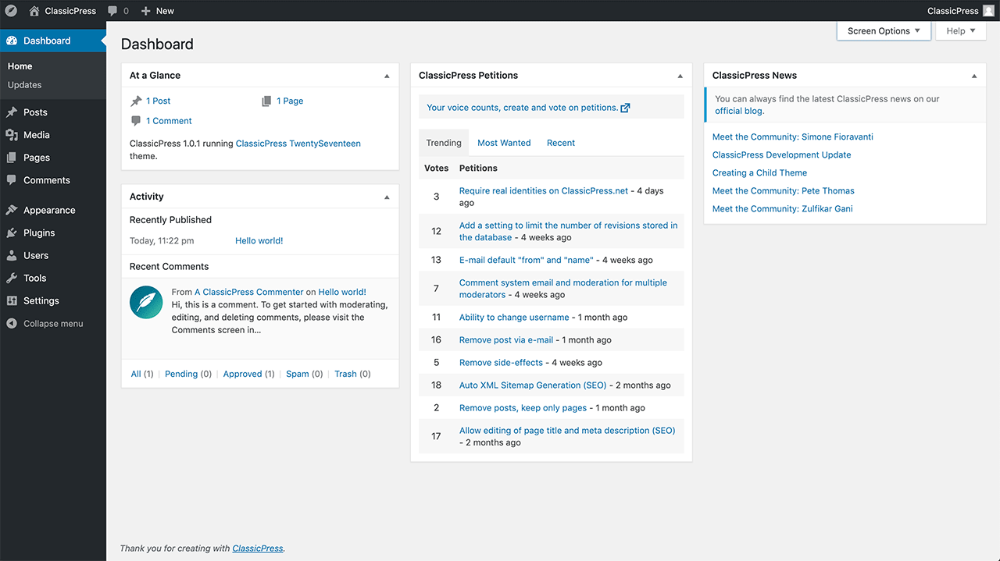

<!-- generated -->

# ClassicPress

1-Click installation template for ClassicPress on Easypanel

## Description

ClassicPress is a community-led open source content management system for creators. It is a fork of WordPress 6.2 that preserves the TinyMCE classic editor as the default option. It is half the size of WordPress, contains less bloat improving performance, and has no block editor (Gutenberg/Full Site Editing).

## Benefits

- Open-Source CMS: ClassicPress is an open-source content management system (CMS) that focuses on security, stability, and simplicity. It is a community-driven alternative to WordPress, designed for users who want more control and fewer unnecessary updates.
- Multi-Site Capability: ClassicPress supports multi-site setups, allowing users to manage multiple websites from a single installation. This makes it an ideal solution for agencies and businesses managing multiple sites.
- Customizable Environment: ClassicPress offers a wide range of plugins and themes for customization. Users can configure the CMS environment to fit their specific needs, ensuring a highly personalized experience.

## Features

- User-Friendly Interface: ClassicPress provides a familiar and easy-to-navigate interface for content management. Its dashboard is intuitive, making it accessible for both beginners and advanced users.
- Enhanced Security: ClassicPress places a strong emphasis on security, with a focus on minimizing vulnerabilities. Regular updates and a security-first approach help keep your site safe.
- Custom Post Types: The CMS supports custom post types, giving users the flexibility to create different content types beyond posts and pages. This feature is essential for building complex websites with varied content structures.
- Plugin and Theme Compatibility: ClassicPress is compatible with a wide range of plugins and themes, making it easy to extend functionality and customize the appearance of your site.

## Links

- [Website](https://www.classicpress.net/)
- [Documentation](https://docs.classicpress.net/)
- [Github](https://github.com/ClassicPress/)
- [Template Source](https://github.com/easypanel-io/templates/tree/main/templates/classicpress)

## Options

Name | Description | Required | Default Value
-|-|-|-
App Service Name | - | yes | classicpress
App Service Image | - | yes | classicpress/classicpress:php8.3-apache

## Screenshots

## Change Log

- 2025-02-14 – first release

## Contributors

- [Ahson Shaikh](https://github.com/Ahson-Shaikh)
