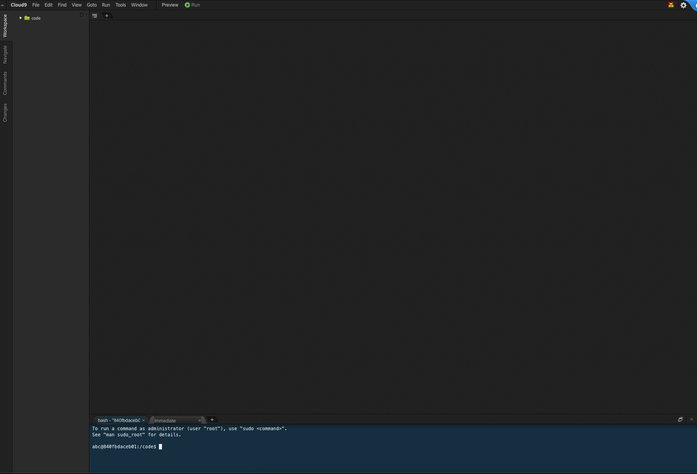

<!-- generated -->

# Cloud9

1-Click installation template for Cloud9 on Easypanel

## Description

Cloud9 is a cloud-based integrated development environment (IDE) designed for developers to code, build, and debug applications collaboratively in real time. It supports a wide range of programming languages and provides a full-featured development environment directly in the browser. Cloud9 allows developers to work on their projects from anywhere, using any device, with the power of a full Linux server behind it. It includes features like built-in terminal, code editor, and support for debugging and running applications seamlessly. Cloud9 is trusted by developers for its efficiency, collaboration tools, and ability to streamline the development workflow.

## Benefits

- Cloud-Based Development: Cloud9 enables developers to code directly in the cloud, providing access to their development environment from anywhere with an internet connection.
- Real-Time Collaboration: Developers can collaborate in real time, sharing their environment with team members, making it an ideal choice for remote or distributed teams.
- Fully Integrated Tools: Cloud9 offers a built-in terminal, code editor, and debugger, streamlining the development workflow without the need for additional installations.

## Features

- Browser-Based IDE: Cloud9 provides a powerful, browser-based IDE that includes a rich text editor, syntax highlighting, and a terminal, making it easy to develop applications without requiring local installations.
- Multi-Language Support: Cloud9 supports a wide range of programming languages, from Python to JavaScript, enabling developers to work on diverse projects within a single platform.
- Scalable and Customizable: Cloud9 can be scaled to meet the needs of different projects and environments, with full support for customizing the IDE settings and environment configurations.

## Links

- [Website](https://aws.amazon.com/cloud9/)
- [Documentation](https://docs.aws.amazon.com/cloud9/)
- [Github](https://github.com/c9)
- [Template Source](https://github.com/easypanel-io/templates/tree/main/templates/cloud9)

## Options

Name | Description | Required | Default Value
-|-|-|-
App Service Name | - | yes | cloud9
App Service Image | - | yes | lscr.io/linuxserver/cloud9:1.29.2
Username | - | yes | admin
Password | - | yes | admin

## Screenshots

## Change Log

- 2024-12-26 – First release

## Contributors

- [Ahson Shaikh](https://github.com/Ahson-Shaikh)
