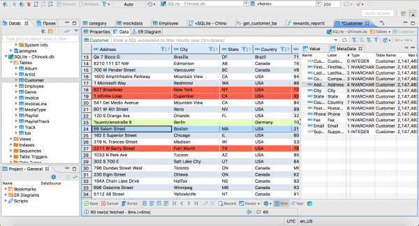

<!-- generated -->

# CloudBeaver

1-Click installation template for CloudBeaver on Easypanel

## Description

CloudBeaver is a web-based database management tool developed by DBeaver team. It provides a modern, intuitive interface for managing databases through your web browser. CloudBeaver supports multiple database types including PostgreSQL, MySQL, MariaDB, SQLite, Oracle, SQL Server, and many others. Perfect for teams who need collaborative database management without installing desktop software.

## Instructions

On first launch, a setup wizard will guide you to create an administrator account and configure the server. After completing the wizard, log in with the credentials you created.

## Benefits

- Web-Based Interface: Access your databases from anywhere using just a web browser, no desktop software required
- Multi-Database Support: Connect to PostgreSQL, MySQL, Oracle, SQL Server, SQLite, and dozens of other database types
- Team Collaboration: Share database connections and queries with your team through a centralized web interface
- Enterprise Features: Advanced authentication, user management, and security features for enterprise environments

## Features

- Visual Query Builder: Build complex SQL queries using an intuitive drag-and-drop interface
- Data Editor: View, edit, and manage database records with spreadsheet-like functionality
- SQL Editor: Advanced SQL editor with syntax highlighting, autocomplete, and execution planning
- Database Navigator: Browse database schemas, tables, views, and other objects in a tree structure
- Connection Management: Manage multiple database connections with secure credential storage
- Data Export/Import: Export query results and import data in various formats including CSV, JSON, and SQL
- User Management: Role-based access control with support for teams and individual users
- Query History: Keep track of executed queries and reuse them across sessions
- Database Metadata: View detailed information about tables, indexes, constraints, and relationships
- Custom Dashboards: Create personalized dashboards with charts and visualizations

## Links

- [Website](https://cloudbeaver.io/)
- [Documentation](https://github.com/dbeaver/cloudbeaver/wiki)
- [GitHub](https://github.com/dbeaver/cloudbeaver)
- [Template Source](https://github.com/easypanel-io/templates/tree/main/templates/cloudbeaver)

## Options

Name | Description | Required | Default Value
-|-|-|-
App Service Name | - | yes | cloudbeaver
App Service Image | - | yes | dbeaver/cloudbeaver:25.1.2

## Screenshots

## Change Log

- 2025-07-11 – Initial release

## Contributors

- [Ahson Shaikh](https://github.com/Ahson-Shaikh)
