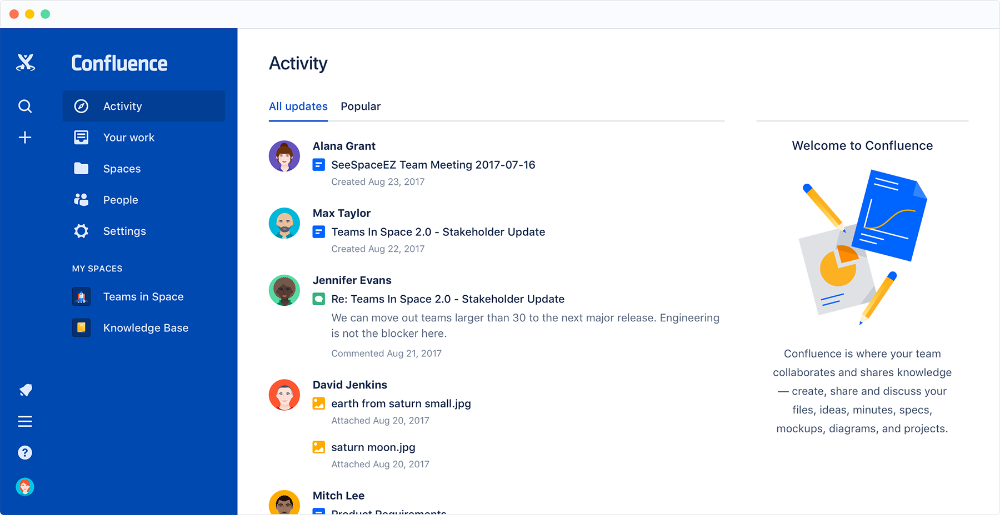

<!-- generated -->

# Confluence

1-Click installation template for Confluence on Easypanel

## Description

Confluence is a powerful team collaboration and knowledge-sharing tool. It allows you to create, organize, and collaborate on content in a centralized space. Designed for project management, documentation, and team communication, Confluence helps streamline workflows and enhances productivity. It offers seamless integration with other Atlassian products such as Jira and Bitbucket, making it an ideal solution for agile teams. The intuitive editor and advanced search capabilities ensure that team knowledge is easily accessible. With extensive customization, permission controls, and plugin support, Confluence is a scalable solution for teams of all sizes.

## Instructions

Get the License Key to access Confluence.

## Benefits

- Centralized Knowledge Base: Confluence provides a centralized space for team documentation and knowledge sharing. This ensures that all team members can easily access important information and contribute to content creation.
- Seamless Collaboration: Teams can collaborate in real-time on documents, comment on pages, and track changes easily. This helps improve communication and boosts overall team productivity.
- Integration with Atlassian Ecosystem: Confluence integrates seamlessly with Jira, Bitbucket, and other Atlassian tools, providing a cohesive workflow for agile teams. This makes task tracking, reporting, and documentation effortless.

## Features

- Intuitive Content Editor: The content editor allows you to create well-structured and visually appealing documents with ease. It supports rich text, tables, media embeds, and macros to enhance content.
- Advanced Search and Organization: Confluence offers powerful search and organization features, helping you quickly find pages and spaces. Tags, labels, and hierarchical page structures improve content discoverability.
- Permissions and Access Control: With detailed permissions and access control settings, you can ensure that sensitive information is protected while allowing open collaboration on other content.
- Customization and Plugins: Confluence supports extensive customization and a wide range of plugins. This allows you to tailor the platform to meet your team’s specific needs.
- Version History and Page Tracking: Track changes made to pages with version history, ensuring that you can review, compare, and restore previous versions if needed.

## Links

- [Documentation](https://confluence.atlassian.com)
- [Dockerhub](https://hub.docker.com/r/atlassian/confluence-server)
- [Template Source](https://github.com/easypanel-io/templates/tree/main/templates/confluence)

## Options

Name | Description | Required | Default Value
-|-|-|-
App Service Name | - | yes | confluence
App Service Image | - | yes | atlassian/confluence-server:8.6-ubuntu-jdk17

## Screenshots

## Change Log

- 2025-02-13 – First Release

## Contributors

- [Ahson Shaikh](https://github.com/Ahson-Shaikh)
