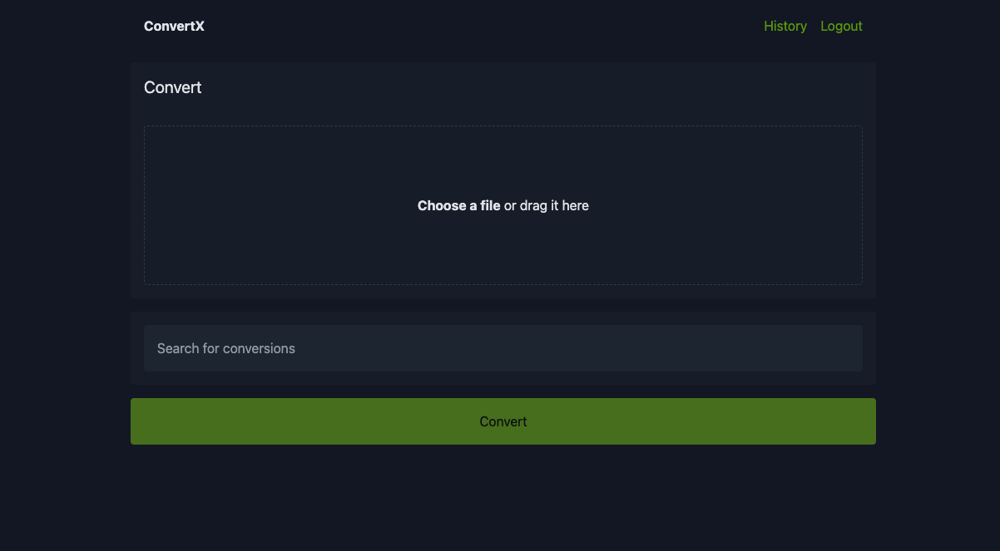

<!-- generated -->

# Convertx

1-Click installation template for Convertx on Easypanel

## Description

Convertx is a free, open-source application designed to provide a fast, lightweight media conversion tool that you can use on your desktop or integrate into your workflows. It offers a range of features including support for multiple file formats, batch processing, video trimming, audio extraction, and format customization. It also supports hot-reloading of tasks and notifications upon completion.

## Benefits

- Efficient and Fast: Convertx is optimized for high performance, enabling fast media conversion without sacrificing quality.
- User-Friendly: Convertx is designed with an intuitive interface, making it accessible to both novice and advanced users.
- Customizable and Open-Source: Convertx is open-source, allowing you to customize it to your exact needs and deploy it in the environment of your choice.

## Features

- Multi-Format Support: Convertx supports a wide range of file formats, ensuring compatibility with your media conversion needs.
- Batch Processing: Easily process multiple files at once, saving time and effort for large workloads.
- Video Trimming: Trim videos to the desired length with precision, directly within Convertx.
- Audio Extraction: Extract audio from video files effortlessly and save them in your preferred format.
- Format Customization: Customize the output format, including resolution, bitrate, and encoding options.
- Hot-Reloading of Tasks: Monitor and manage tasks in real-time with live progress updates.
- Notification Support: Receive notifications when your media conversions are complete, even for large batches.

## Links

- [Github](https://github.com/C4illin/ConvertX/tree/main)
- [Template Source](https://github.com/easypanel-io/templates/tree/main/templates/convertx)

## Options

Name | Description | Required | Default Value
-|-|-|-
App Service Name | - | yes | convertx
App Service Image | - | yes | ghcr.io/c4illin/convertx:v0.10.0

## Screenshots

## Change Log

- 2025-01-20 – First Release

## Contributors

- [Ahson Shaikh](https://github.com/Ahson-Shaikh)
