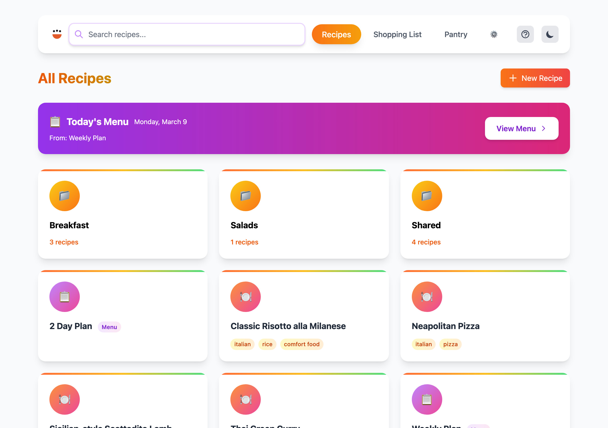

<!-- generated -->

# CookCLI

1-Click installation template for CookCLI on Easypanel

## Description

CookCLI is a command line recipe manager for Cooklang files that can also run a local web interface for browsing and working with recipe collections. This template deploys the CookCLI server mode with persistent recipe storage.

## Instructions

Deploy the template and open the app URL to access the CookCLI web interface.

## Benefits

- Self-Hosted Recipe Workspace: Keep your Cooklang recipe collection in your own infrastructure with full control over files and updates.
- Web and CLI Friendly: Run the same CookCLI toolchain while exposing a browser-based recipe UI.
- Simple Persistent Storage: Store recipes in a mounted volume at /recipes for reliable long-term use.

## Features

- Cooklang Native: Works directly with Cooklang recipe files without proprietary formats.
- Lightweight Service: Single-container deployment with straightforward configuration.
- Persistent Recipe Mount: Volume-backed /recipes path ensures files survive redeployments.

## Links

- [Website](https://cooklang.org/cli/)
- [Documentation](https://cooklang.org/cli/help/)
- [GitHub](https://github.com/cooklang/cookcli)
- [Template Source](https://github.com/easypanel-io/templates/tree/main/templates/cookcli)

## Options

Name | Description | Required | Default Value
-|-|-|-
App Service Name | - | yes | cookcli
App Service Image | - | yes | ghcr.io/cooklang/cookcli:0.29.1

## Screenshots

## Change Log

- 2026-03-31 – Initial template release
- 2026-04-29 – Version Bumped to 0.29.1

## Contributors

- [Ahson Shaikh](https://github.com/Ahson-Shaikh)
