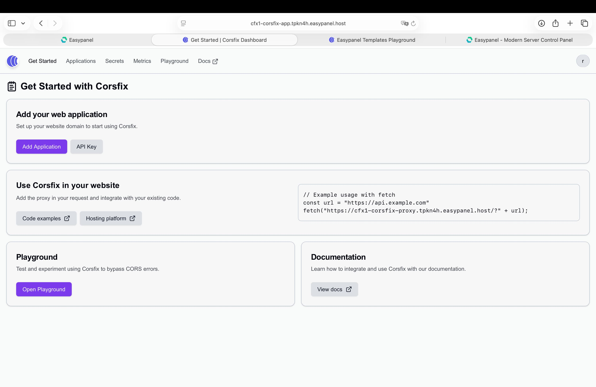
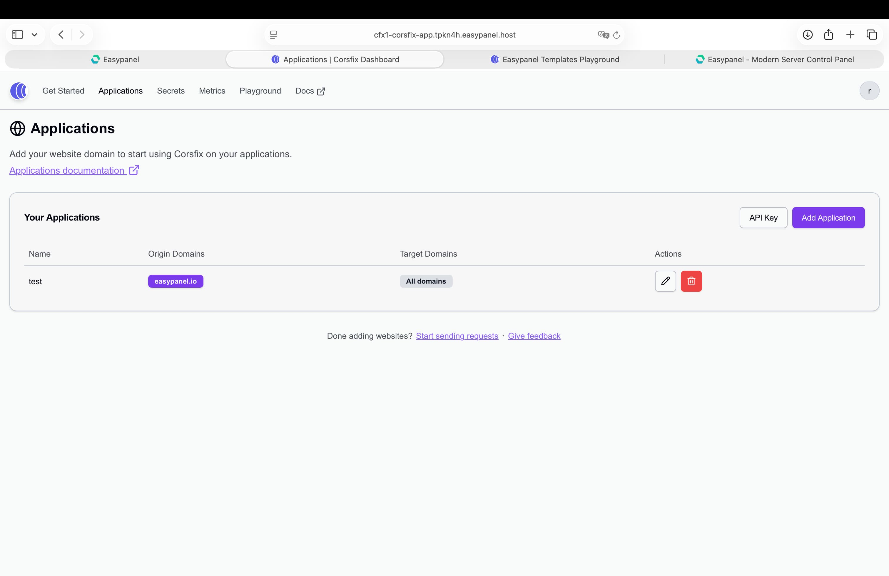
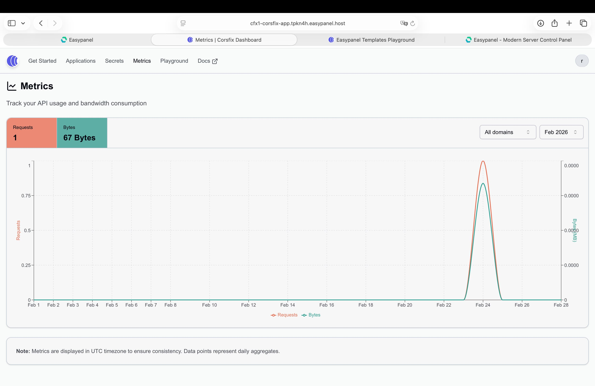
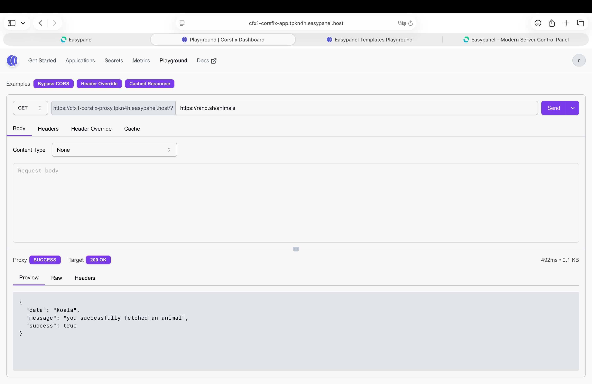
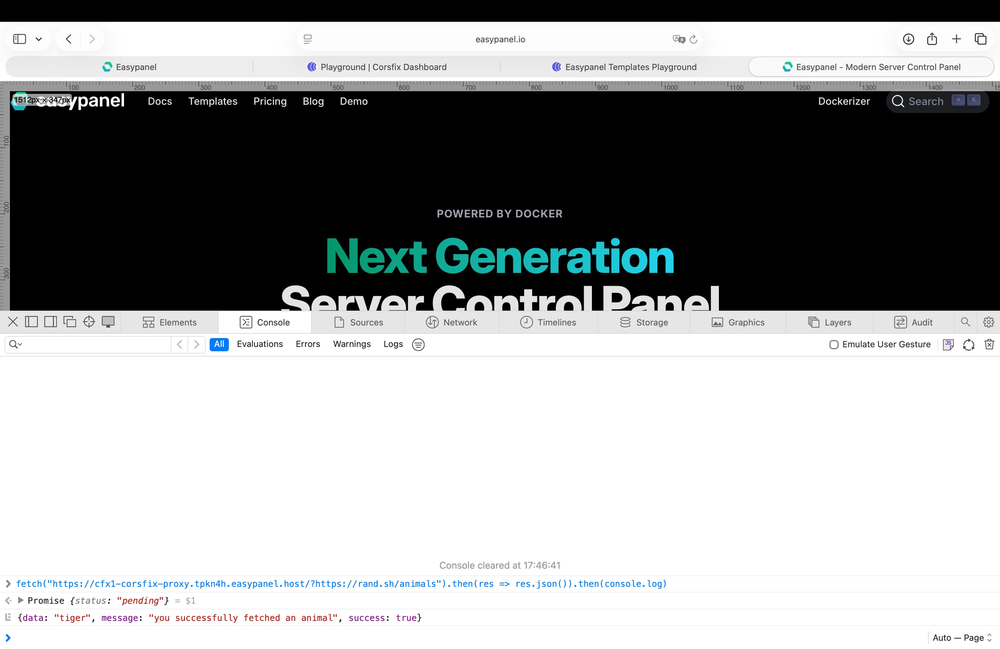
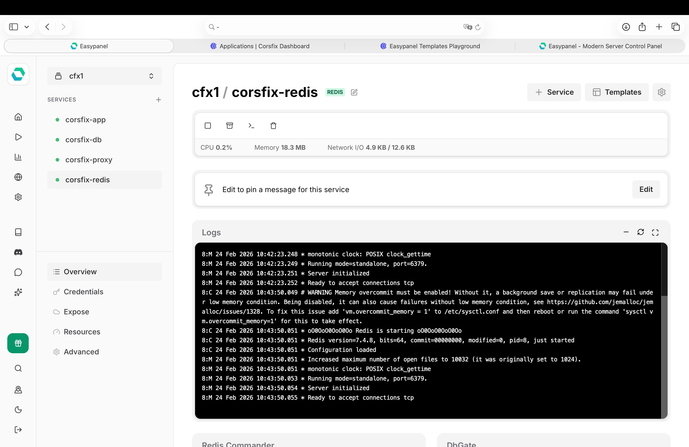

<!-- generated -->

# Corsfix

1-Click installation template for Corsfix on Easypanel

## Description

Corsfix is a CORS proxy that eliminates cross-origin errors and lets you fetch any data for your website with zero hassle. It acts as an intermediary between your applications and target servers, automatically adding the necessary CORS headers to responses. Corsfix handles your requests securely while keeping API keys and credentials safe.

## Benefits

- Fix CORS Errors Instantly: Eliminate cross-origin errors that prevent browsers from accessing resources. Just one line change to your code and Corsfix handles the rest, no complex server-side workarounds needed.
- Self-Hosted and Private: Run Corsfix on your own infrastructure with full control over your data and proxy configurations. No third-party dependencies or external services involved.
- Secure by Design: Protected against SSRF with DNS-level validation to block access to localhost, private networks, and local files. Cookie leakage is prevented by renaming Set-Cookie headers to X-Corsfix-Set-Cookie, stopping unintended cookie sharing across proxied domains.
- Minimal Latency: Responses are streamed directly from the target server through the proxy, ensuring minimal latency without buffering the entire response first.
- Seamless Integration: Add the proxy URL before your target API endpoint and you're done. No SDK or library required — works with any HTTP client or frontend framework.

## Features

- App Dashboard: A web interface for managing which website domains can access your proxy and which target domains the proxy is allowed to fetch.
- CORS Proxy Server: A high-performance proxy server that acts as an intermediary between your applications and target servers, automatically adding the necessary CORS headers to responses for seamless cross-origin communication.
- Secure API Key Management: Securely manage API keys and credentials without exposing them in your frontend code. Keep sensitive data safe while still accessing the services you need.
- Override Request Headers: Override forbidden headers that browsers normally restrict, giving you full control over the request headers sent to the target server.
- Cached Responses: Set cache headers on proxied responses to speed up repeated requests and reduce load on target servers.
- JSONP Response: Support for JSONP responses, enabling cross-origin data fetching for legacy applications that rely on JSONP callbacks.
- Playground: A built-in playground to test proxy requests directly from the dashboard, making it easy to debug and verify your configurations before deploying.
- Metrics: Monitor traffic and request volume to your proxy with built-in metrics, giving you visibility into usage patterns and performance.

## Links

- [Corsfix CORS proxy](https://corsfix.com)
- [Documentation](https://corsfix.com/docs)
- [Github](https://github.com/corsfix/corsfix)
- [Template Source](https://github.com/easypanel-io/templates/tree/main/templates/corsfix)

## Options

Name | Description | Required | Default Value
-|-|-|-
App Service Name | - | yes | corsfix
App Service Image | - | yes | ghcr.io/corsfix/corsfix-app:e0ff7b3472256650afc547a672d0a2ffafba34e8
Proxy Service Image | - | yes | ghcr.io/corsfix/corsfix-proxy:e0ff7b3472256650afc547a672d0a2ffafba34e8

## Screenshots

## Change Log

- 2026-02-24 – Initial template

## Contributors

- [Corsfix](https://github.com/corsfix)
