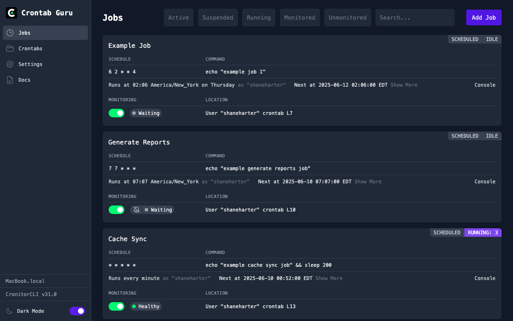

<!-- generated -->

# Crontab Guru

1-Click installation template for Crontab Guru on Easypanel

## Description

Crontab Guru is a simple web interface for managing and testing cron expressions. It provides an intuitive dashboard for creating, editing, and validating crontab entries with real-time feedback. Perfect for system administrators and developers who need to schedule tasks and want to ensure their cron expressions are correct before deployment.

## Instructions

Login using the default credentials; admin/secret123

## Benefits

- Cron Expression Validation: Test and validate your cron expressions before deployment to ensure they run at the correct times.
- Visual Cron Builder: Build cron expressions visually with an intuitive interface that shows next run times.
- Crontab Management: Manage your crontab entries through a clean web interface with persistent storage.
- Real-time Feedback: Get immediate feedback on your cron expressions with human-readable descriptions.

## Features

- Cron Expression Editor: Visual editor for creating and modifying cron expressions with syntax highlighting and validation.
- Schedule Preview: Preview when your cron jobs will run with a clear timeline view of upcoming executions.
- Expression Validation: Real-time validation of cron expressions with detailed error messages and suggestions.
- Persistent Storage: Store your crontab configurations persistently with volume mounting for data retention.
- Web Interface: Clean, responsive web interface accessible from any browser for easy cron management.
- Example Library: Built-in library of common cron expression examples for quick reference and learning.

## Links

- [Website](https://crontab.guru)
- [Documentation](https://crontab.guru/examples.html)
- [Template Source](https://github.com/easypanel-io/templates/tree/main/templates/crontab-guru)

## Options

Name | Description | Required | Default Value
-|-|-|-
App Service Name | - | yes | crontab-guru
App Service Image | - | yes | dockeriddonuts/crontab-dashboard:1.0

## Screenshots

## Change Log

- 2025-07-21 – Initial release (dockeriddonuts/crontab-dashboard:1.0)

## Contributors

- [Ahson Shaikh](https://github.com/Ahson-Shaikh)
