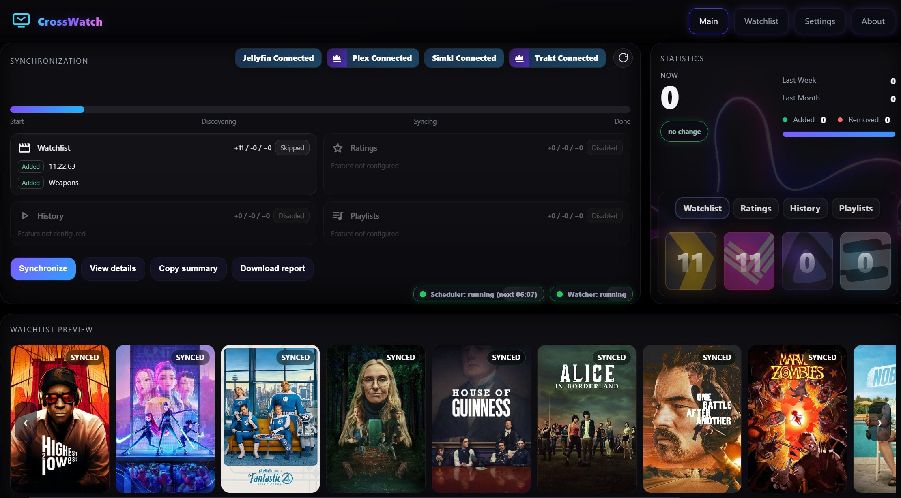

<!-- generated -->

# Crosswatch

1-Click installation template for Crosswatch on Easypanel

## Description

CrossWatch is a self-hosted synchronization engine that keeps Plex, Jellyfin, Emby, SIMKL, Trakt, AniList, TMDb, MDBList, and Tautulli aligned. It runs locally with a web UI on port 8787 where you link accounts, define sync pairs, run them manually or on a schedule, and review stats and history. It includes a built-in tracker with snapshots, profiles for separate setups (e.g. family or different servers), watchlist and progress sync, scrobbling and webhooks to trackers, and tools like Analyzer, Editor, and Captures for stuck or inconsistent items. Configuration persists under /config; set TZ for your timezone.

## Benefits

- One sync hub: Configure Plex, Jellyfin, Emby, and multiple trackers from a single web UI with profiles for separate users or servers.
- Rich sync & scrobble: Watchlists, ratings, history, progress between servers, and scrobbling to Trakt, SIMKL, MDBList—without requiring Plex Pass or Emby Premiere for watcher flows.
- Data safety: Built-in tracker snapshots and Captures help you inspect, adjust, or roll back provider data when something looks wrong.
- Persistent config: State lives in /config so accounts, pairs, and schedules survive restarts.

## Features

- Sync pairs & scheduling: Define what syncs between which services; run on demand or on simple or advanced schedules.
- Analyzer & Editor: Find stuck or inconsistent items across providers; inspect and fix or block entries.
- Unified watchlist & player card: See combined watchlists and what is playing across your setup in real time.
- Timezone support: Set TZ so schedules and timestamps match your region.

## Links

- [Website](https://crosswatch.app)
- [Documentation](https://wiki.crosswatch.app)
- [GitHub](https://github.com/cenodude/CrossWatch)
- [Template Source](https://github.com/easypanel-io/templates/tree/main/templates/crosswatch)

## Options

Name | Description | Required | Default Value
-|-|-|-
App Service Name | - | yes | crosswatch
App Service Image | - | yes | ghcr.io/cenodude/crosswatch:0.9.15
Timezone | Timezone for the application (e.g., Asia/Karachi, America/New_York, Europe/London) | yes | Asia/Karachi

## Screenshots

## Change Log

- 2025-01-21 – Initial Template Release

## Contributors

- [Ahson Shaikh](https://github.com/Ahson-Shaikh)
