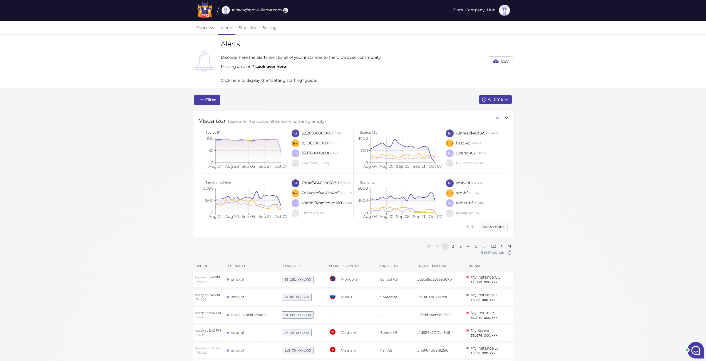

<!-- generated -->

# CrowdSec

1-Click installation template for CrowdSec on Easypanel

## Description

CrowdSec is a free, modern, and collaborative security engine utilizing crowdsourcing to generate cyber threat intelligence data. It analyzes visitor behavior &amp; provides an adapted response to all kinds of attacks. It can read logs, spot malevolent visitors, and trigger appropriate remediation.

## Benefits

- Real-time Protection: Detect and block attacks in real-time using behavior analysis.
- Community-driven: Benefit from shared threat intelligence across the CrowdSec community.
- Easy Integration: Seamlessly integrates with popular services like Nginx, Apache, and more.
- Automated Response: Automatically block malicious IPs and protect your infrastructure.
- Open Source: Free, open-source solution with a strong community backing.

## Features

- Log Analysis: Advanced log parsing and analysis capabilities.
- Threat Detection: Detect various types of attacks including brute force, port scanning, and more.
- IP Reputation: Access to community-maintained IP reputation database.
- Multiple Backends: Support for various remediation backends like iptables, nginx, etc.
- API Access: RESTful API for integration with other security tools.

## Links

- [Website](https://www.crowdsec.net/)
- [Documentation](https://docs.crowdsec.net/)
- [Github](https://github.com/crowdsecurity/crowdsec)
- [Template Source](https://github.com/easypanel-io/templates/tree/main/templates/crowdsec)

## Options

Name | Description | Required | Default Value
-|-|-|-
App Service Name | - | yes | crowdsec
App Service Image | - | yes | crowdsecurity/crowdsec

## Screenshots

## Change Log

- 2024-04-09 – First Release

## Contributors

- [CrowdSec](https://github.com/crowdsecurity)
