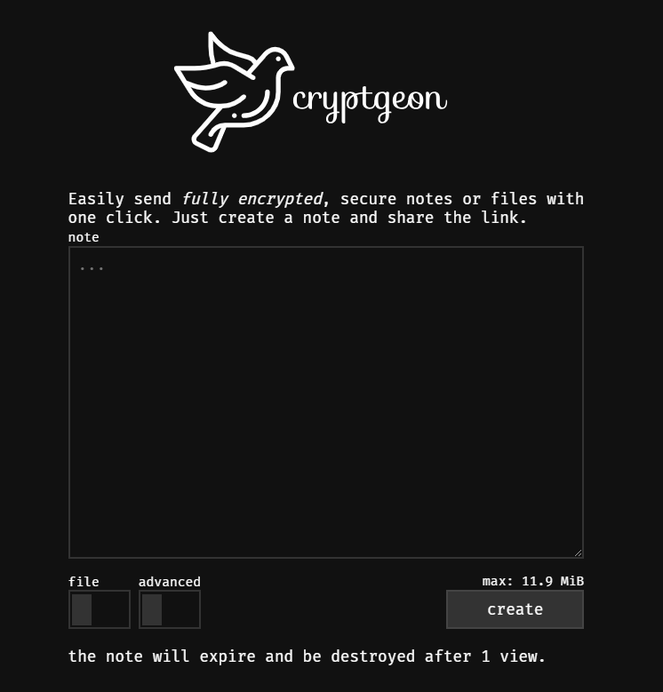

<!-- generated -->

# Cryptgeon

1-Click installation template for Cryptgeon on Easypanel

## Description

Cryptgeon is a secure, open source sharing note or file service inspired by PrivNote. It includes a server, a web page and a CLI client.

## Benefits

- Secure Sharing: Cryptgeon uses encryption to ensure your shared notes and files remain confidential.
- Multi-Platform Access: Access your content via the server, web page, or CLI client for versatility.
- Open Source & Transparent: Built as an open source project, Cryptgeon encourages community trust and collaboration.

## Features

- Server Component: Handles secure sharing of notes and files.
- Web Interface: A user-friendly web page for easy note and file access.
- CLI Client: A command-line tool for managing and sharing notes and files.
- Secure Encryption: Implements robust encryption protocols to protect your data.

## Links

- [Github](https://github.com/cupcakearmy/cryptgeon)
- [Template Source](https://github.com/easypanel-io/templates/tree/main/templates/cryptgeon)

## Options

Name | Description | Required | Default Value
-|-|-|-
App Service Name | - | yes | cryptgeon
App Service Image | - | yes | cupcakearmy/cryptgeon:2.9.1

## Screenshots

## Change Log

- 2025-03-11 – First Release

## Contributors

- [Ahson Shaikh](https://github.com/Ahson-Shaikh)
