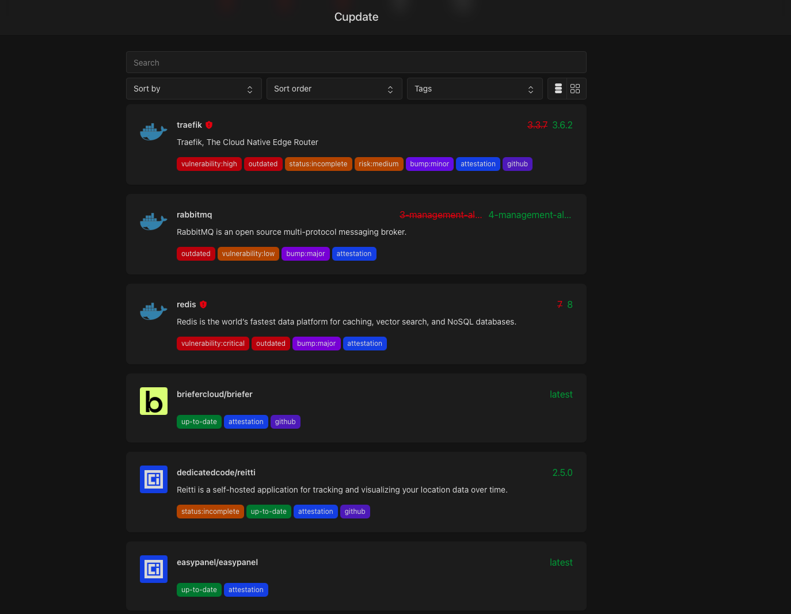

<!-- generated -->

# Cupdate

1-Click installation template for Cupdate on Easypanel

## Description

Cupdate is a self-hosted web application for monitoring and managing Docker container updates. It provides a centralized dashboard to track available updates for your running containers, view container versions, and manage update notifications. By connecting to the Docker daemon via the Docker socket, Cupdate scans all running containers and checks for newer image versions available in container registries. The web interface displays an overview of your container infrastructure with update status, image tags, registry information, and visual indicators for outdated containers. Cupdate features automatic update checking on a configurable schedule, support for multiple container registries, detailed container information with links to documentation and registries, and the ability to manage container logos and metadata. With its lightweight architecture and persistent storage using BoltDB and SQLite, Cupdate offers an efficient solution for staying informed about container updates without requiring complex automation or CI/CD pipelines. Perfect for home lab administrators managing multiple Docker containers, DevOps teams maintaining staging environments, system administrators tracking container versions across servers, or anyone who wants visibility into their Docker infrastructure&#39;s update status without manually checking each container.

## Benefits

- Centralized Update Monitoring: Track all your Docker container updates from a single dashboard, eliminating the need to manually check each container for available updates.
- Proactive Update Awareness: Stay informed about available container updates with automatic checking and visual indicators, helping you maintain security and access new features.
- Simplified Container Management: Get a comprehensive overview of your Docker infrastructure with version information, registry links, and update status at a glance.
- Lightweight & Self-Hosted: Run entirely on your own infrastructure with minimal resource requirements, ensuring your container information remains private.

## Features

- Automatic Update Scanning: Automatically scans running containers and checks container registries for newer image versions on a configurable schedule.
- Web-Based Dashboard: Intuitive web interface displaying all containers, their current versions, available updates, and registry information.
- Multi-Registry Support: Works with Docker Hub, GitHub Container Registry (ghcr.io), and other container registries to check for updates.
- Container Metadata Management: Store and display custom logos, descriptions, and metadata for your containers for better organization and identification.
- Persistent Storage: Uses BoltDB for caching and SQLite for database storage, ensuring data persists across container restarts.
- Docker Socket Integration: Connects directly to the Docker daemon via socket to monitor all running containers without requiring external APIs or credentials.

## Links

- [Website](https://alexgustafsson.github.io/cupdate)
- [GitHub](https://github.com/alexgustafsson/cupdate)
- [Template Source](https://github.com/easypanel-io/templates/tree/main/templates/cupdate)

## Options

Name | Description | Required | Default Value
-|-|-|-
App Service Name | - | yes | cupdate
App Service Image | - | yes | ghcr.io/alexgustafsson/cupdate:0.24.5

## Screenshots

## Change Log

- 2026-03-25 – Added official logo asset and corrected registry link label
- 2025-11-26 – Template Release
- 2026-04-29 – Version bumped to 0.24.5

## Contributors

- [Ahson Shaikh](https://github.com/Ahson-Shaikh)
