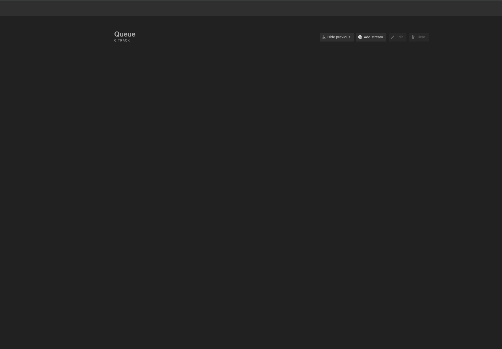

<!-- generated -->

# Daapd

1-Click installation template for Daapd on Easypanel

## Description

Daapd is a robust, open-source DAAP (Digital Audio Access Protocol) server that allows users to share music libraries over a network. It is designed to work seamlessly with iTunes, Roku SoundBridges, and other DAAP clients, providing an efficient and reliable way to stream audio content across devices. Daapd also supports streaming internet radio, podcasts, and AirPlay devices. With its powerful backend, Daapd ensures smooth performance, a wide range of supported formats, and advanced features like library management and transcoding.

## Benefits

- Seamless Audio Streaming: Daapd provides smooth streaming of music libraries across multiple devices, including iTunes, Roku SoundBridges, and other DAAP-compatible clients.
- Advanced Media Management: Daapd offers features like library organization, metadata management, and support for multiple audio formats to keep your collection accessible and well-organized.
- Network-Friendly: Daapd is optimized for network performance, ensuring minimal latency and high-quality audio streaming over both wired and wireless connections.

## Features

- DAAP Protocol Support: Daapd fully supports the DAAP protocol, allowing devices like iTunes and other DAAP clients to access and play media libraries seamlessly.
- AirPlay Integration: Stream your audio to AirPlay-compatible devices directly through Daapd, enhancing your home or office audio experience.
- Internet Radio and Podcast Support: In addition to local music libraries, Daapd allows streaming of internet radio stations and podcasts for added entertainment options.

## Links

- [Website](https://github.com/ejurgensen/forked-daapd)
- [Documentation](https://ejurgensen.github.io/forked-daapd/)
- [Github](https://github.com/ejurgensen/forked-daapd)
- [Template Source](https://github.com/easypanel-io/templates/tree/main/templates/daapd)

## Options

Name | Description | Required | Default Value
-|-|-|-
App Service Name | - | yes | daapd
App Service Image | - | yes | lscr.io/linuxserver/daapd:28.10.20250108

## Screenshots

## Change Log

- 2024-12-26 – First Release
- 2025-01-09 – Version bumped to 28.10.20250108

## Contributors

- [Ahson Shaikh](https://github.com/Ahson-Shaikh)
