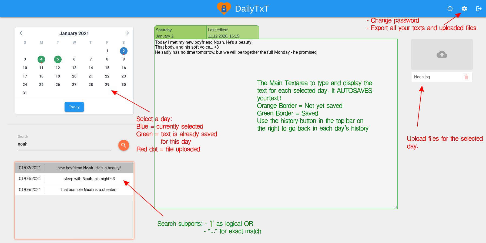

<!-- generated -->

# DailyTxT

1-Click installation template for DailyTxT on Easypanel

## Description

DailyTxT is a secure, encrypted personal diary web application that allows users to write and manage daily entries with end-to-end encryption. It provides a user-friendly interface for journaling with features like file uploads, search functionality, and multi-language support. All data is encrypted locally, ensuring complete privacy and security for personal thoughts and memories.

## Instructions

After deployment, open DailyTxT from your app domain and create your first account (if allow registration is enabled).

## Benefits

- End-to-End Encryption: All diary entries and uploaded files are encrypted locally using your personal encryption key, ensuring complete privacy and security of your personal thoughts and memories.
- Secure File Storage: Upload and attach files to your diary entries with automatic encryption, providing a secure way to store photos, documents, and other media alongside your written entries.
- Privacy-First Design: Built with privacy as the core principle, DailyTxT ensures that only you can access your data through your personal encryption key, with no external data sharing or cloud dependencies.
- Multi-User Support: Support for multiple user accounts with individual encryption keys, making it suitable for families or small teams who want to maintain separate, secure diary spaces.

## Features

- Encrypted Diary Entries: Write and store daily diary entries with automatic encryption using your personal encryption key, ensuring complete privacy and security.
- File Upload Support: Attach files, photos, and documents to your diary entries with automatic encryption and secure storage alongside your written content.
- Search Functionality: Search through your encrypted diary entries efficiently with built-in search capabilities that work across all your stored content.
- Multi-Language Support: Automatic language detection based on browser settings with support for English and German, with more languages planned for future releases.
- Responsive Design: Optimized interface for both desktop and mobile devices, providing a seamless journaling experience across all your devices.
- JWT Authentication: Secure authentication system with configurable JWT token expiration, providing flexible session management for different security needs.
- Data Persistence: All diary entries, uploaded files, and user preferences persist across container restarts and updates with encrypted local storage.
- Update Notifications: Optional automatic checking for newer versions of DailyTxT to keep your installation up-to-date with the latest features and security improvements.

## Links

- [Demo](https://dailytxt.phitux.de)
- [Documentation](https://github.com/PhiTux/DailyTxT#readme)
- [GitHub](https://github.com/PhiTux/DailyTxT)
- [Template Source](https://github.com/easypanel-io/templates/tree/main/templates/dailytxt)

## Options

Name | Description | Required | Default Value
-|-|-|-
App Service Name | - | yes | dailytxt
App Service Image | - | yes | phitux/dailytxt:1.0.15
Allow Registration | Allow new users to register | yes | true
JWT Expiration Days | Days until JWT token expires | yes | 60

## Screenshots

## Change Log

- 2025-10-03 – First Release
- 2026-03-25 – Added logo asset and fixed secret env wiring in template

## Contributors

- [Ahson Shaikh](https://github.com/Ahson-Shaikh)
