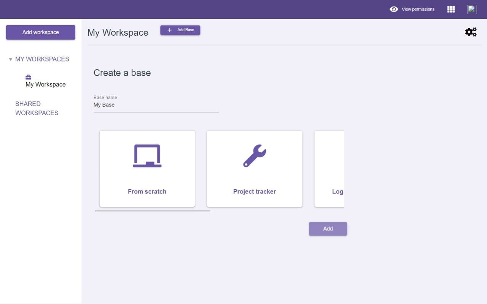

<!-- generated -->

# Daptin

1-Click installation template for Daptin on Easypanel

## Description

Daptin is an open-source backend development framework that enables rapid development and deployment of production-ready JSONAPI microservices. Design your data model and have a production-ready JSON API online in minutes.

## Benefits

- Rapid API Development: Create production-ready JSON APIs in minutes.
- JSON:API Compliance: Built-in support for JSON:API specification.
- Data Model Design: Visual data model design and automatic API generation.
- Production Ready: Includes authentication, validation, and real-time updates.

## Features

- CRUD Operations: Automatic CRUD endpoints for your data models.
- API Documentation: Built-in OpenAPI/Swagger documentation.
- Authentication: Built-in user authentication and authorization.
- Real-time Updates: WebSocket support for real-time data updates.

## Links

- [Documentation](https://daptin.github.io/docs/)
- [Website](https://daptin.github.io/daptin/)
- [GitHub](https://github.com/daptin/daptin)
- [Template Source](https://github.com/easypanel-io/templates/tree/main/templates/daptin)

## Options

Name | Description | Required | Default Value
-|-|-|-
App Service Name | - | yes | daptin
Daptin Image | - | yes | daptin/daptin:v0.11.3

## Screenshots

## Change Log

- 2025-03-28 – Initial template release

## Contributors

- [Ahson Shaikh](https://github.com/Ahson-Shaikh)
