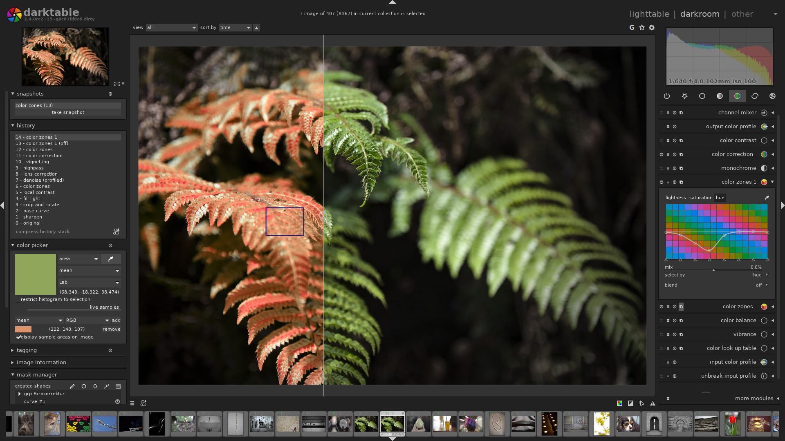

<!-- generated -->

# Darktable

1-Click installation template for Darktable on Easypanel

## Description

Darktable is an open-source photography workflow application and raw developer. It manages your digital negatives in a database, lets you view them through a zoomable lighttable, and enables you to develop raw images and enhance them with powerful editing tools. This browser-accessible version provides the full Darktable desktop application through a web interface, allowing you to edit photos from anywhere without local installation.

## Benefits

- Professional Photo Editing: Industry-standard tools for professional photographers including non-destructive RAW development and advanced color management.
- Web-Based Access: Access the full Darktable application through your browser from any device without installing software locally.
- RAW Image Support: Native support for hundreds of RAW formats from various camera manufacturers for optimal image quality.
- Non-Destructive Workflow: All edits are non-destructive and stored separately, allowing unlimited experimentation without damaging original files.

## Features

- Lighttable Mode: Organize and manage your photo collection with filtering, tagging, and rating capabilities in an intuitive interface.
- Darkroom Mode: Powerful editing tools including exposure, color correction, sharpening, noise reduction, and dozens of other modules.
- Color Management: Professional color management with support for ICC profiles and various color spaces for accurate color reproduction.
- Export Options: Export images in multiple formats with customizable settings for print, web, or further processing in other applications.

## Links

- [Website](https://www.darktable.org/)
- [Documentation](https://docs.darktable.org/)
- [GitHub](https://github.com/darktable-org/darktable)
- [Template Source](https://github.com/easypanel-io/templates/tree/main/templates/darktable)

## Options

Name | Description | Required | Default Value
-|-|-|-
App Service Name | - | yes | darktable
App Service Image | - | yes | lscr.io/linuxserver/darktable:2025-07-12-ls220
Timezone | - | no | Etc/UTC

## Screenshots

## Change Log

- 2025-10-13 – Initial Template Release (2025-07-12-ls220)

## Contributors

- [Ahson Shaikh](https://github.com/Ahson-Shaikh)
