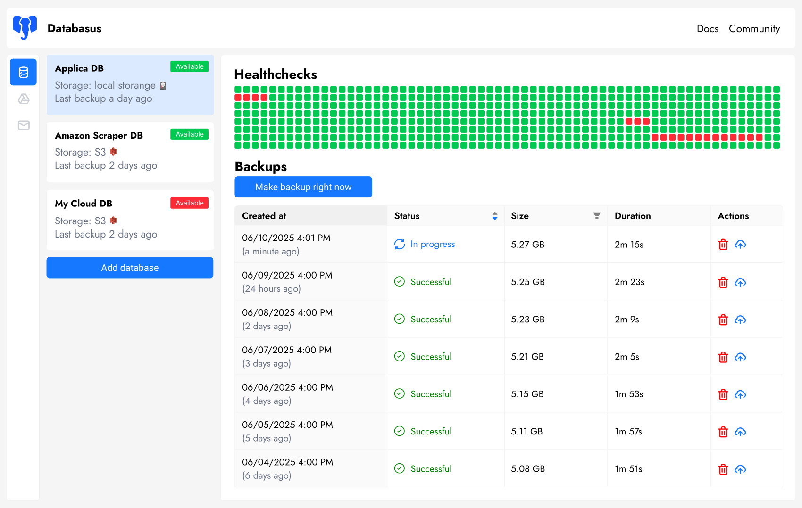

<!-- generated -->

# Databasus

1-Click installation template for Databasus on Easypanel

## Description

Databasus is a free, open source, self-hosted backup platform focused on PostgreSQL with support for MySQL, MariaDB, and MongoDB. It helps you schedule backups, apply retention policies, store backups in multiple destinations, and receive notifications about backup progress.

## Instructions

After deployment, open your domain and complete the initial setup in the Databasus UI. The template already mounts persistent storage at /databasus-data so configuration and backup metadata survive restarts.

## Benefits

- Automated backups: Schedule reliable backups with flexible intervals and retention controls.
- Multi-database support: Manage PostgreSQL, MySQL, MariaDB, and MongoDB backups in one interface.
- Self-hosted control: Keep backup data and operations on infrastructure you control.

## Features

- Storage destinations: Send backups to local storage and cloud targets like S3-compatible systems.
- Notifications: Receive backup status alerts via channels such as email, Slack, or Telegram.
- Web management UI: Configure backup jobs, policies, and integrations from a browser dashboard.

## Links

- [Website](https://databasus.com)
- [Documentation](https://databasus.com/installation)
- [GitHub](https://github.com/databasus/databasus)
- [Container registry](https://hub.docker.com/r/databasus/databasus)
- [Template Source](https://github.com/easypanel-io/templates/tree/main/templates/databasus)

## Options

Name | Description | Required | Default Value
-|-|-|-
App Service Name | - | yes | databasus
Databasus Image | - | yes | databasus/databasus:v3.33.0

## Screenshots

## Change Log

- 2026-04-07 – Initial template release
- 2026-04-29 – Version bumped to v3.33.0

## Contributors

- [Ahson Shaikh](https://github.com/Ahson-Shaikh)
