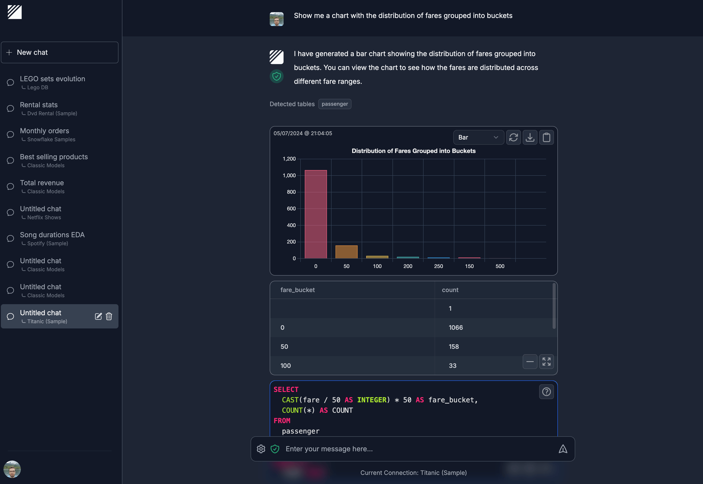

<!-- generated -->

# Dataline

1-Click installation template for Dataline on Easypanel

## Description

Dataline is a powerful data management and visualization tool that helps users organize, analyze, and visualize their data in an intuitive way. It provides a user-friendly interface for data manipulation, chart creation, and data sharing capabilities. With its modern design and robust features, Dataline makes it easy to work with various data formats and create meaningful visualizations.

## Benefits

- Intuitive Data Management: Easily organize and manage your data with a user-friendly interface.
- Powerful Visualization Tools: Create stunning visualizations and charts from your data with built-in tools.
- Data Sharing: Share your data and visualizations with team members or the public.

## Features

- Data Organization: Organize and structure your data in a way that makes sense for your workflow.
- Chart Creation: Create various types of charts and graphs to visualize your data.
- Data Import/Export: Import data from various sources and export in multiple formats.
- User Interface: Modern and responsive interface for easy data management and visualization.

## Links

- [GitHub](https://github.com/ramiawar/dataline)
- [Docker Hub](https://hub.docker.com/r/ramiawar/dataline)
- [Template Source](https://github.com/easypanel-io/templates/tree/main/templates/dataline)

## Options

Name | Description | Required | Default Value
-|-|-|-
App Service Name | - | yes | dataline
Dataline Image | - | yes | ramiawar/dataline:v1.1.5

## Screenshots

## Change Log

- 2025-03-24 – Initial template release

## Contributors

- [Ahson Shaikh](https://github.com/Ahson-Shaikh)
