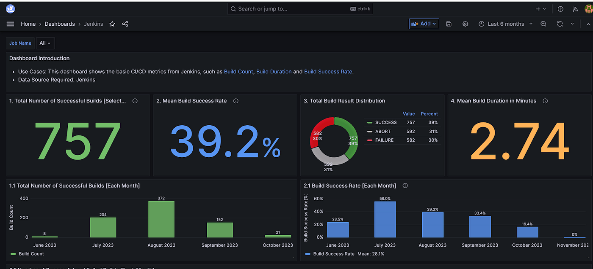

<!-- generated -->

# DevLake

1-Click installation template for DevLake on Easypanel

## Description

DevLake is a highly customizable and self-hosted tool for engineering metrics and data integration. It enables teams to collect, transform, and visualize data from various development tools like GitHub, GitLab, and Jira. DevLake provides insightful dashboards and reports for continuous improvement, streamlining your software delivery process.

## Instructions

Wait for the migration on backend to complete. Access Grafana using https://domain/grafana

## Benefits

- Centralized Data Integration: DevLake consolidates data from various tools into a single platform for better visibility and analysis.
- Enhanced Team Productivity: Gain actionable insights to optimize engineering workflows and improve team performance.
- Open-Source and Flexible: Leverage an open-source solution with the flexibility to adapt to your organization’s specific needs.

## Features

- Data Synchronization: Seamlessly integrate data from popular development tools like GitHub, GitLab, Jira, and more.
- Customizable Dashboards: Visualize key metrics with prebuilt or custom dashboards tailored to your team’s goals.
- Powerful API: Use DevLake’s API to programmatically interact with and extend its capabilities.
- Community and Enterprise Plugins: Enhance functionality with a rich set of plugins for various tools and workflows.

## Links

- [Documentation](https://devlake.apache.org/docs/GettingStarted)
- [Github](https://github.com/apache/incubator-devlake)
- [Template Source](https://github.com/easypanel-io/templates/tree/main/templates/devlake)

## Options

Name | Description | Required | Default Value
-|-|-|-
App Service Name | - | yes | devlake
UI Service Image | - | yes | devlake.docker.scarf.sh/apache/devlake-config-ui:v1.0.2-beta5
Backend Service Image | - | yes | devlake.docker.scarf.sh/apache/devlake:v1.0.2-beta5
Grafana Service Image | - | yes | devlake.docker.scarf.sh/apache/devlake-dashboard:v1.0.2-beta5

## Screenshots

## Change Log

- 2025-01-15 – Template Release

## Contributors

- [Ahson Shaikh](https://github.com/Ahson-Shaikh)
