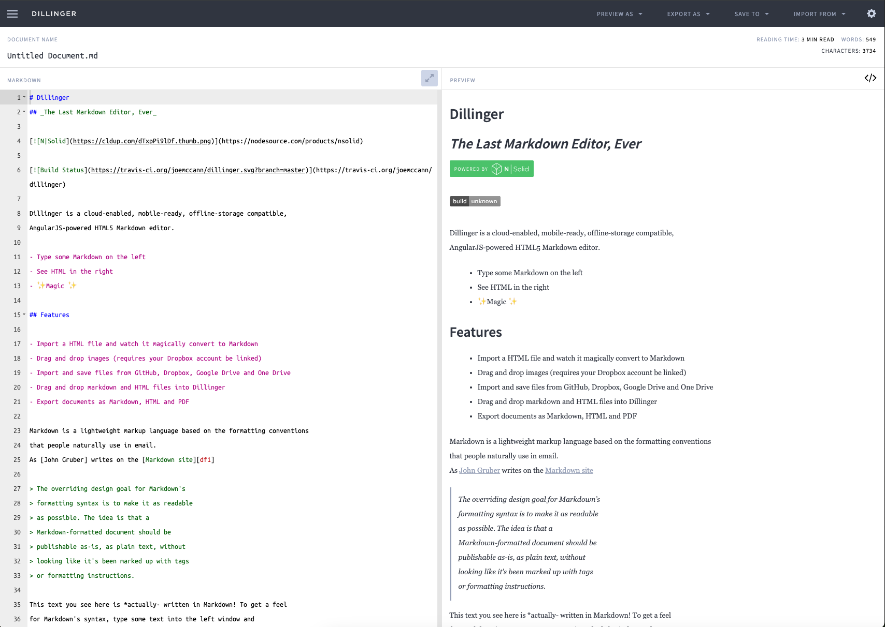

<!-- generated -->

# Dillinger

1-Click installation template for Dillinger on Easypanel

## Description

Dillinger is an open-source, online Markdown editor designed to provide a seamless and user-friendly experience for writing and editing Markdown files. With its intuitive interface, Dillinger supports real-time preview, file imports/exports, and integration with popular cloud storage services such as Dropbox, Google Drive, GitHub, and OneDrive. It allows users to write Markdown efficiently and export their work in various formats, including HTML, PDF, and Markdown itself. Dillinger operates as a modern, distraction-free editor that simplifies writing and content creation for developers, writers, and professionals.

## Benefits

- Seamless Markdown Editing: Dillinger simplifies Markdown editing with an intuitive and distraction-free interface, enabling efficient content creation.
- Real-Time Preview: Provides a real-time preview of Markdown documents, helping you see changes instantly as you write.
- Cloud Storage Integration: Supports integration with popular cloud storage services like Dropbox, Google Drive, GitHub, and OneDrive for easy file management and synchronization.

## Features

- Real-Time Markdown Preview: See a live preview of your Markdown document as you write, ensuring accuracy and saving time.
- Export Options: Export Markdown files to various formats, including HTML, PDF, and plain Markdown for flexibility in publishing and sharing.
- File Import and Cloud Sync: Import files from and sync content with services like Dropbox, Google Drive, GitHub, and OneDrive for convenient file access.
- User-Friendly Interface: Dillinger offers a clean and distraction-free editor, ensuring a seamless writing experience for both new and experienced users.

## Links

- [Demo](https://dillinger.io/)
- [GitHub](https://github.com/joemccann/dillinger)
- [Template Source](https://github.com/easypanel-io/templates/tree/main/templates/dillinger)

## Options

Name | Description | Required | Default Value
-|-|-|-
App Service Name | - | yes | dillinger
App Service Image | - | yes | lscr.io/linuxserver/dillinger:3.39.1

## Screenshots

## Change Log

- 2024-12-11 – first release

## Contributors

- [Ahson Shaikh](https://github.com/Ahson-Shaikh)
