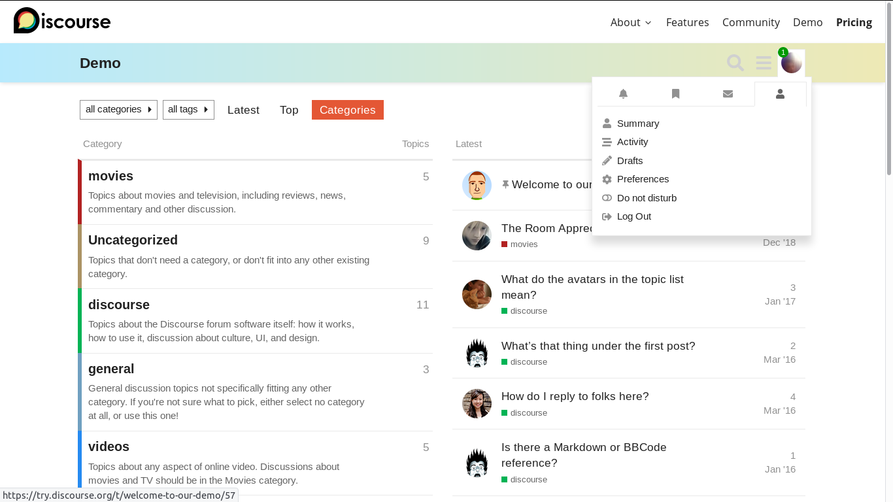

<!-- generated -->

# Discourse

1-Click installation template for Discourse on Easypanel

## Description

Discourse is a modern, open-source discussion platform that provides a clean, intuitive interface for community discussions. It&#39;s perfect for forums, mailing lists, chat rooms, and more.

## Instructions

Once clicked, please wait for the installation to complete, it will take time. It is also resource intensive, so make sure you have more than 8GB of RAM.

## Benefits

- Modern Discussion Platform: Clean, intuitive interface for community discussions and forums
- Self-hosted Solution: Keep your community data private by hosting your own platform
- Scalable Architecture: Built with performance and scalability in mind
- Open Source: Free and open-source platform with active community support

## Features

- Rich Text Editor: Advanced text editing with markdown support
- Real-time Updates: Live updates and notifications
- Mobile Responsive: Fully responsive design for all devices
- User Management: Comprehensive user and permission management
- Search Functionality: Powerful search capabilities
- Plugin System: Extensible through plugins and themes

## Links

- [Website](https://www.discourse.org)
- [Documentation](https://docs.discourse.org)
- [GitHub](https://github.com/discourse/discourse)
- [Docker Hub](https://hub.docker.com/r/bitnami/discourse)
- [Template Source](https://github.com/easypanel-io/templates/tree/main/templates/discourse)

## Options

Name | Description | Required | Default Value
-|-|-|-
App Service Name | - | yes | discourse
App Service Image | - | yes | bitnami/discourse:3.4.5
Discourse Email | - | yes | admin@example.com
Discourse Username | - | yes | admin
Discourse Password | Passwort must be at least 10 characters long | yes | adminpassword123

## Screenshots

## Change Log

- 2025-04-30 – Initial release
- 2025-07-15 – Version bumped to 3.4.5

## Contributors

- [Ahson Shaikh](https://github.com/Ahson-Shaikh)
