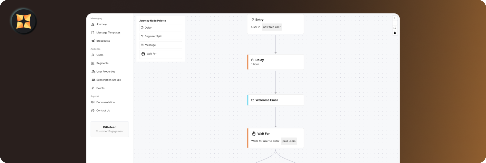

<!-- generated -->

# Dittofeed

1-Click installation template for Dittofeed on Easypanel

## Description

Dittofeed is an advanced, self-hosted customer engagement platform designed to streamline and enhance your marketing automation workflows. It empowers businesses with real-time insights, robust data-driven personalization, and multi-channel communication tools, including email, SMS, and push notifications. Dittofeed offers a user-friendly interface, powerful API integrations, and extensive customization options, making it ideal for organizations of all sizes. By providing a self-hosted solution, Dittofeed ensures data privacy and compliance while giving you full control over your infrastructure and customer data.

## Benefits

- Streamlined Marketing Automation: Dittofeed simplifies customer engagement by providing an intuitive way to manage, analyze, and optimize your marketing workflows across multiple channels.
- Self-Hosted Flexibility: Maintain full control over your customer data and operations with a self-hosted setup that ensures privacy and compliance.
- Enhanced Customer Insights: Gain valuable insights into customer behavior and engagement with detailed analytics and reporting tools.

## Features

- Powerful API Access: Seamlessly integrate Dittofeed into your existing systems using its robust API for efficient data handling and personalized communications.
- Multi-Channel Communication: Engage with customers through email, SMS, push notifications, and other channels, all from a unified platform.
- Customizable Campaigns: Tailor your marketing campaigns with dynamic content, audience segmentation, and automated triggers to maximize engagement.
- Real-Time Analytics: Monitor campaign performance with real-time metrics, user interactions, and conversion tracking for data-driven decision-making.

## Links

- [Documentation](https://docs.dittofeed.com/introduction)
- [Github](https://github.com/dittofeed/dittofeed)
- [Template Source](https://github.com/easypanel-io/templates/tree/main/templates/dittofeed)

## Options

Name | Description | Required | Default Value
-|-|-|-
App Service Name | - | yes | dittofeed
App Service Image | - | yes | dittofeed/dittofeed-lite:v0.19.0
Clickhouse Service Image | - | yes | clickhouse/clickhouse-server:23.8.8.20-alpine
Minio Service Image | - | yes | minio/minio:latest
Temporal Service Image | - | yes | temporalio/auto-setup:1.22.4
Temporal UI Service Image | - | yes | temporalio/ui:2.22.1
Default Workspace Name | - | yes | default
Dittofeed Password | - | yes | admin12345
Click House User | - | yes | clickhouse
Click House Password | - | yes | clickhouse
Minio User | - | yes | admin
Minio Password | - | yes | password

## Screenshots

## Change Log

- 2025-01-03 – Template Release

## Contributors

- [Ahson Shaikh](https://github.com/Ahson-Shaikh)
