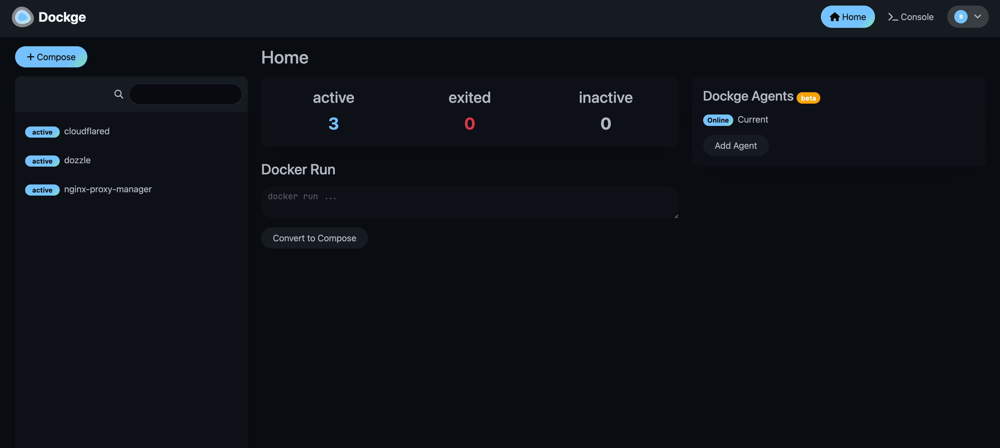

<!-- generated -->

# Dockge

1-Click installation template for Dockge on Easypanel

## Description

Dockge is a modern, self-hosted Docker Compose management tool that provides a beautiful and intuitive web interface for managing your Docker Compose stacks. It allows you to create, edit, start, stop, and monitor your Docker Compose applications through a user-friendly dashboard. Dockge simplifies Docker Compose management with features like real-time logs, stack monitoring, and easy configuration editing.

## Benefits

- Docker Compose Management: Beautiful web interface for managing Docker Compose stacks with real-time monitoring, logs, and easy configuration editing.
- Self-Hosted Solution: Complete control over your Docker Compose management with a self-hosted solution that keeps your infrastructure private and secure.
- Real-Time Monitoring: Monitor your Docker Compose stacks in real-time with live logs, status updates, and performance metrics.
- Easy Configuration: Intuitive interface for creating, editing, and managing Docker Compose files without command-line complexity.

## Features

- Stack Management: Create, start, stop, and delete Docker Compose stacks through an intuitive web interface with one-click operations.
- Real-Time Logs: View real-time logs from your Docker Compose services with filtering and search capabilities for better debugging.
- Configuration Editor: Built-in YAML editor with syntax highlighting and validation for editing Docker Compose files directly in the browser.
- Service Monitoring: Monitor service health, resource usage, and status with comprehensive dashboards and alerts.
- Backup and Restore: Backup and restore your Docker Compose configurations and data with built-in backup management tools.
- Multi-Stack Support: Manage multiple Docker Compose stacks from a single interface with organized project management and categorization.

## Links

- [GitHub](https://github.com/louislam/dockge)
- [Documentation](https://dockge.kuma.pet/)
- [Docker Hub](https://hub.docker.com/r/louislam/dockge)
- [Template Source](https://github.com/easypanel-io/templates/tree/main/templates/dockge)

## Options

Name | Description | Required | Default Value
-|-|-|-
App Service Name | - | yes | dockge
App Service Image | Dockge Docker image | yes | louislam/dockge:1.5.0

## Screenshots

## Change Log

- 2025-09-11 – Initial Template Release

## Contributors

- [Ahson Shaikh](https://github.com/Ahson-Shaikh)
