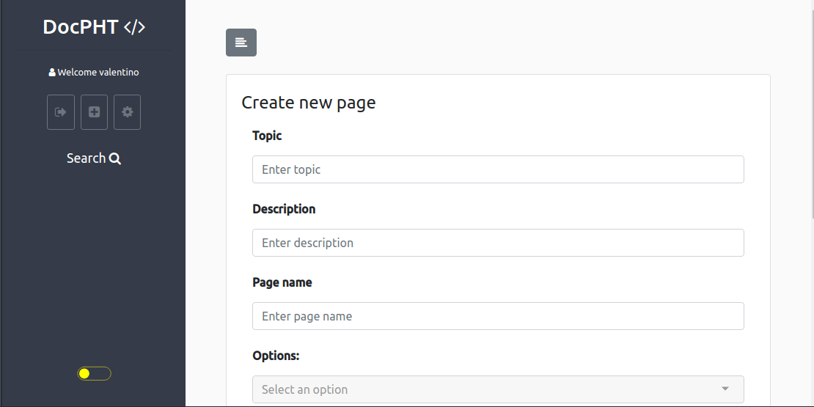

<!-- generated -->

# DocPHT

1-Click installation template for DocPHT on Easypanel

## Description

DocPHT is a document management system that helps you organize and manage your documents. It provides a simple and intuitive interface for storing, organizing, and sharing documents.

## Benefits

- Document Management: Organize and manage your documents efficiently
- Simple Interface: User-friendly interface for document management
- Organization: Organize documents into categories and tags
- Self-Hosted: Keep your documents private and secure

## Features

- Document Storage: Store and manage your documents
- Categories: Organize documents into categories
- Tags: Add tags to documents for better organization
- Search: Search through your documents
- Export: Export documents in various formats

## Links

- [GitHub](https://github.com/docpht/docpht)
- [Website](https://docpht.org)
- [Documentation](https://docs.docpht.org)
- [Template Source](https://github.com/easypanel-io/templates/tree/main/templates/docpht)

## Options

Name | Description | Required | Default Value
-|-|-|-
App Service Name | - | yes | docpht
App Service Image | - | yes | docpht/docpht:v1.3.2

## Screenshots

## Change Log

- 2025-04-11 – First Release

## Contributors

- [Ahson Shaikh](https://github.com/Ahson-Shaikh)
