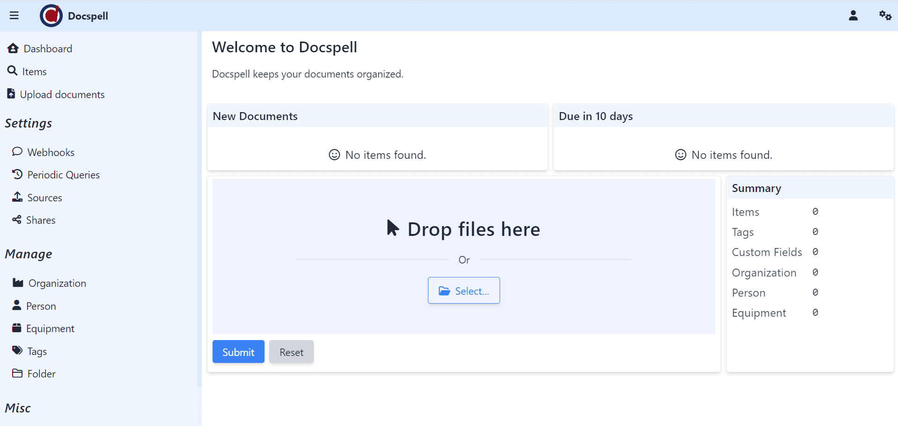

<!-- generated -->

# Docspell

1-Click installation template for Docspell on Easypanel

## Description

Docspell is a personal document management system designed to archive and organize your digital documents. It helps you scan, organize, search, and retrieve your documents with ease. Docspell automatically processes documents, extracts text via OCR, and makes your documents searchable through full-text search powered by Solr. The system consists of multiple components a REST server for the web interface, a job executor (joex) for background processing, a directory consumer for automatic document ingestion, and Solr for powerful search capabilities. Docspell helps you categorize documents, add metadata, and efficiently manage your paperwork in a secure, self-hosted environment.

## Instructions

The initial setup requires creating a user account.

## Benefits

- Document Organization: Docspell helps you organize your digital documents with automatic metadata extraction and customizable tagging.
- Full-Text Search: Find any document quickly with powerful full-text search capabilities powered by Solr.
- Self-Hosted Solution: Maintain privacy and control over your documents with a completely self-hosted system.

## Features

- OCR Processing: Automatically extract text from scanned documents to make them searchable.
- Automated Ingestion: Set up automatic document processing through various input methods including email and directory watching.
- Metadata Management: Organize documents with tags, correspondents, and other metadata fields.
- Multiple User Support: Set up individual or shared document collections with customizable access controls.

## Links

- [Documentation](https://docspell.org/docs/)
- [Github](https://github.com/eikek/docspell)
- [Template Source](https://github.com/easypanel-io/templates/tree/main/templates/docspell)

## Options

Name | Description | Required | Default Value
-|-|-|-
App Service Name | - | yes | docspell
App Service Image | - | yes | ghcr.io/docspell/restserver:v0.42.0
Joex Service Image | - | yes | ghcr.io/docspell/joex:v0.42.0
Consumedir Service Image | - | yes | docspell/dsc:v0.11.0
Solr Service Image | - | yes | solr:9

## Screenshots

## Change Log

- 2025-03-19 – Template Release

## Contributors

- [Ahson Shaikh](https://github.com/Ahson-Shaikh)
