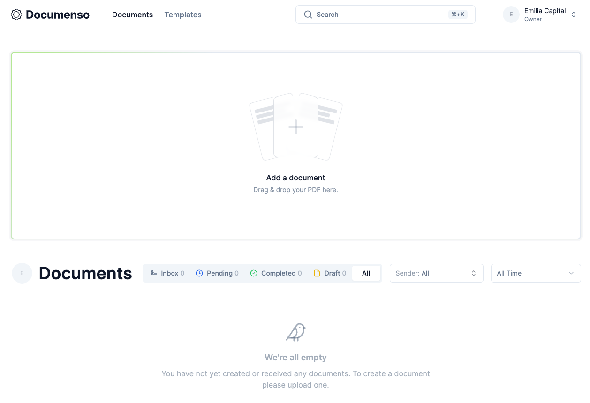

<!-- generated -->

# Documenso

1-Click installation template for Documenso on Easypanel

## Description

The open source DocuSign alternative. Securely sign documents without giving up your privacy or freedom.

## Instructions

Please follow the below given stackoverflow instructions to create the .p12 file and provide the path of that file to the required field.

## Benefits

- Open Source Document Signing: Documenso is an open-source alternative to DocuSign, enabling secure document signing without vendor lock-in.
- Self-Hosted and Privacy-Focused: Host your own document signing solution with full control over your data and privacy.
- Modern Digital Signatures: Supports modern digital signature standards for legally binding document signing.

## Features

- Document Management: Upload, organize, and manage documents for signing in a secure environment.
- E-Signatures: Collect legally binding electronic signatures from multiple parties.
- Signature Tracking: Track the status of document signatures in real-time.
- Email Notifications: Automatic email notifications for signature requests and completions.
- PDF Handling: Advanced PDF document viewing and manipulation capabilities.

## Links

- [Website](https://documenso.com/)
- [Documentation](https://docs.documenso.com/)
- [Github](https://github.com/documenso/documenso)
- [Stackoverflow](https://stackoverflow.com/questions/21141215/creating-a-p12-file)
- [Template Source](https://github.com/easypanel-io/templates/tree/main/templates/documenso)

## Options

Name | Description | Required | Default Value
-|-|-|-
Service Name | - | yes | documenso
App Service Image | - | yes | documenso/documenso:v2.3.1
SMTP Host | - | yes | smtp.example.com
SMTP Port | - | yes | 587
SMTP Username | - | yes | user@example.com
SMTP Password | - | yes | password123
SMTP From Name | - | yes | Documenso
SMTP From Address | - | yes | documents@example.com
P12 Path | The path to the .p12 file that contains the certificate and private key for the Documenso service. | yes | 

## Screenshots

## Change Log

- 2025-05-23 – First release
- 2025-07-15 – Version bumped to v1.12.1
- 2025-12-25 – Version bumped to v2.3.1

## Contributors

- [Ahson Shaikh](https://github.com/Ahson-Shaikh)
