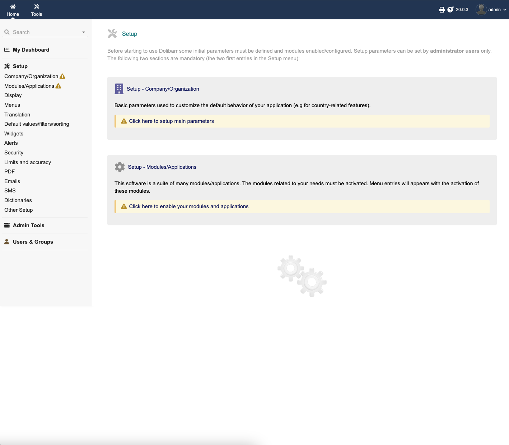

<!-- generated -->

# Dolibarr

1-Click installation template for Dolibarr on Easypanel

## Description

Dolibarr ERP/CRM is an open-source platform designed for small to medium-sized enterprises (SMEs) to manage business operations seamlessly. It offers a comprehensive suite of tools for managing customers, invoices, orders, products, projects, and more. With its modular architecture and user-friendly interface, Dolibarr provides flexibility and scalability for businesses looking for an efficient and customizable ERP/CRM solution.

## Instructions

Default Credentials; username; admin, password; admin

## Benefits

- All-in-One ERP and CRM Solution: Dolibarr integrates ERP and CRM functionalities, providing tools for customer relationship management, inventory, and accounting in a single platform.
- Modular and Scalable: Dolibarr offers a modular structure, allowing businesses to enable only the features they need, ensuring scalability and flexibility.
- Open-Source and Customizable: As an open-source platform, Dolibarr can be fully customized to match specific business workflows and requirements.
- User-Friendly Interface: Enjoy an intuitive and straightforward user experience, ensuring easy navigation and minimal learning curve for teams.
- Secure and Reliable: Benefit from Dolibarr’s security features, such as user access control and permissions, ensuring data integrity and confidentiality.

## Features

- Customer and Contact Management: Manage customer relationships, contacts, and interactions efficiently, enhancing productivity and service delivery.
- Sales and Invoicing: Automate your sales workflow with quotes, orders, and invoice management to streamline billing and payments.
- Inventory and Product Management: Track and manage your inventory, products, and stock levels effortlessly with Dolibarr’s inventory module.
- Project Management: Plan, track, and manage projects, tasks, and milestones, ensuring efficient team collaboration.
- Accounting and Finance: Simplify financial management with built-in tools for managing expenses, income, and reporting.

## Links

- [Website](https://www.dolibarr.org/)
- [Documentation](https://wiki.dolibarr.org/)
- [Compose Docs](https://github.com/Dolibarr/dolibarr/blob/develop/README.md)
- [GitHub](https://github.com/Dolibarr/dolibarr)
- [Template Source](https://github.com/easypanel-io/templates/tree/main/templates/dolibarr)

## Options

Name | Description | Required | Default Value
-|-|-|-
App Service Name | - | yes | dolibarr
App Service Image | - | yes | dolibarr/dolibarr:20

## Screenshots

## Change Log

- 2024-12-17 – First release

## Contributors

- [Ahson Shaikh](https://github.com/Ahson-Shaikh)
