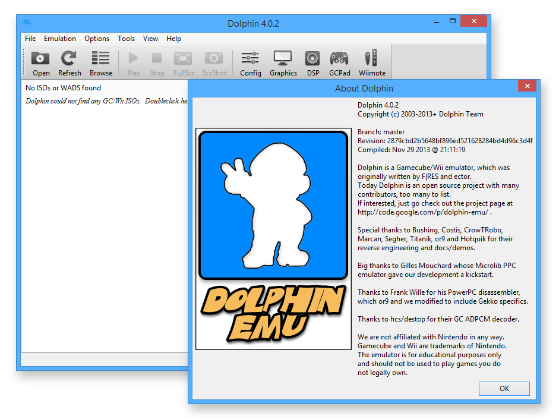

<!-- generated -->

# Dolphin

1-Click installation template for Dolphin on Easypanel

## Description

Dolphin is a powerful GameCube and Wii emulator that allows you to play your favorite Nintendo games on modern hardware. With support for high-definition graphics, save states, and enhanced controls, Dolphin brings classic gaming to life with improved performance and visual quality. This browser-accessible version provides the full Dolphin emulator through a web interface, enabling you to play retro games from anywhere without local installation.

## Instructions

Open Dolphin in your browser and complete the first-run wizard. Add your game files under `/config` (for example in `/config/roms`) so they persist across updates/redeploys, then configure that path in Dolphin&#39;s game directories. For best performance, run this template on a host with hardware acceleration enabled and use a gamepad when possible.

## Benefits

- GameCube & Wii Emulation: Play your favorite Nintendo GameCube and Wii games with high compatibility and accuracy on modern hardware.
- Enhanced Graphics: Enjoy games in high-definition with upscaling, anti-aliasing, and other visual enhancements not available on original hardware.
- Web-Based Access: Access Dolphin emulator through your browser from any device without local installation or complex setup.
- Save States: Quick save and load game states at any point, making it easy to pick up where you left off or retry difficult sections.

## Features

- High Compatibility: Supports a vast library of GameCube and Wii games with excellent compatibility and accuracy.
- Performance Enhancements: Take advantage of modern hardware with multi-core CPU support, speed throttling, and frame skipping options.
- Control Options: Configure keyboard, mouse, or gamepad controls with full customization for optimal gaming experience.
- Graphics Settings: Customize resolution, aspect ratio, shaders, and post-processing effects to enhance visual quality.

## Links

- [Website](https://dolphin-emu.org/)
- [Documentation](https://dolphin-emu.org/docs/guides/)
- [GitHub](https://github.com/dolphin-emu/dolphin)
- [Template Source](https://github.com/easypanel-io/templates/tree/main/templates/dolphin)

## Options

Name | Description | Required | Default Value
-|-|-|-
App Service Name | - | yes | dolphin
App Service Image | - | yes | lscr.io/linuxserver/dolphin:40d9d3af-ls61
Timezone | - | no | Etc/UTC

## Screenshots

## Change Log

- 2025-10-13 – Initial Template Release
- 2026-03-26 – Added setup instructions and screenshot asset
- 2026-04-29 – Version bumped to 40d9d3af-ls61

## Contributors

- [Ahson Shaikh](https://github.com/Ahson-Shaikh)
