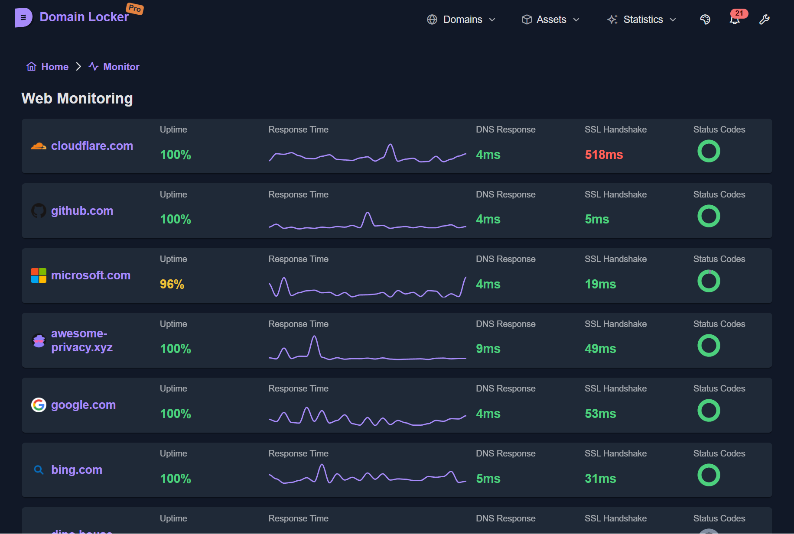
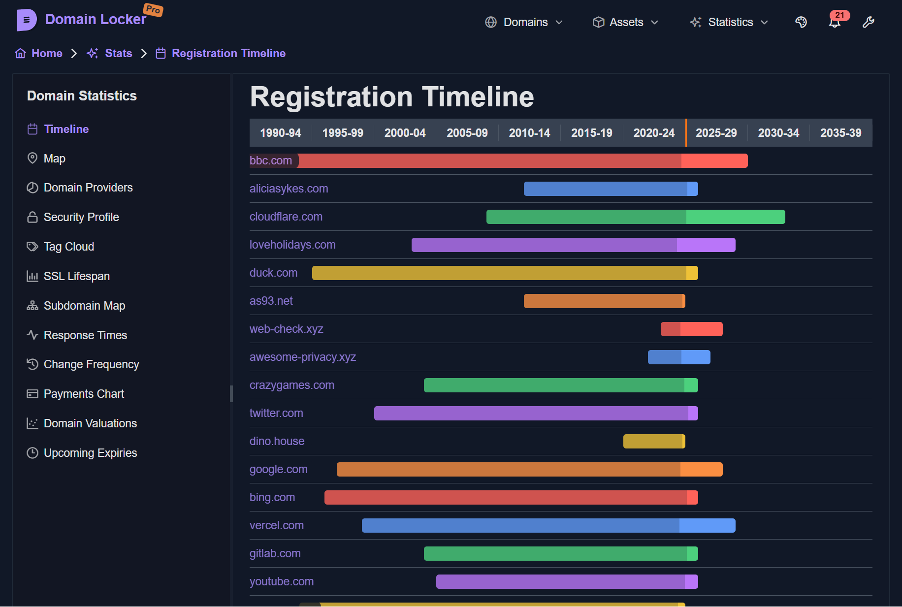
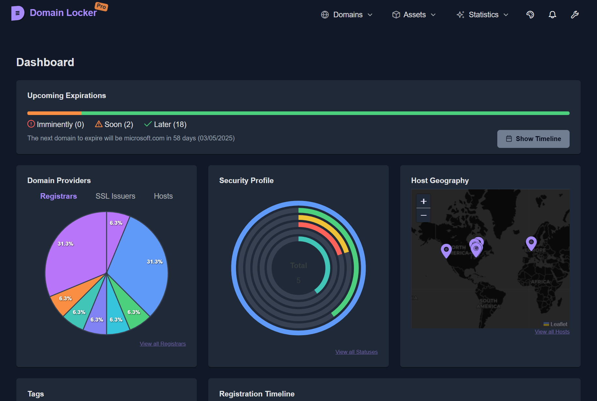

<!-- generated -->

# Domain Locker

1-Click installation template for Domain Locker on Easypanel

## Description

Domain Locker is a self-hosted domain portfolio management and monitoring application designed to help you keep track of all your registered domains. It provides centralized management for domain registrations, expiration dates, renewal reminders, DNS records, SSL certificates, and hosting information. Domain Locker features automated WHOIS lookups, expiration notifications via email, domain health checks, and comprehensive reporting. With scheduled updates and monitoring, you&#39;ll never miss a domain renewal deadline again. The application includes automatic daily checks for domain updates and sends timely expiration reminders. Perfect for domain investors, web developers, agencies, and anyone managing multiple domain portfolios who needs a reliable system to track and monitor their digital assets.

## Benefits

- Never Miss Renewals: Automated expiration monitoring and email reminders ensure you never lose a valuable domain due to missed renewal deadlines.
- Centralized Management: Manage all your domains from one dashboard. Track registrars, nameservers, SSL certificates, and DNS records in a single location.
- Automated Monitoring: Daily automated checks update domain information and health status. Background jobs ensure your data stays current without manual intervention.

## Features

- Domain Portfolio Management: Track all your registered domains with detailed information including registrar, registration date, expiration date, and renewal status.
- Expiration Reminders: Automated email notifications alert you before domains expire. Configurable reminder schedules ensure adequate time for renewals.
- WHOIS Integration: Automatic WHOIS lookups retrieve and update domain information including registrar details, nameservers, and registration dates.
- Domain Health Monitoring: Monitor domain health status, DNS resolution, SSL certificate validity, and overall availability with automated daily checks.
- Scheduled Updates: Cron-based scheduler runs daily domain updates at 3 AM and expiration reminder checks at 4 AM automatically.
- Multi-Domain Support: Manage unlimited domains across multiple registrars with support for different TLDs and domain extensions.

## Links

- [Github](https://github.com/Lissy93/domain-locker)
- [Website](https://domain-locker.com)
- [Documentation](https://domain-locker.com/about)
- [Template Source](https://github.com/easypanel-io/templates/tree/main/templates/domainlocker)

## Options

Name | Description | Required | Default Value
-|-|-|-
App Service Name | - | yes | domainlocker
App Service Image | - | yes | lissy93/domain-locker:0.1.2
Ntfy Server URL (optional) | URL for ntfy.sh notifications (e.g., https://ntfy.sh) | no | 
Ntfy Topic (optional) | Topic name for notifications | no | 

## Screenshots

## Change Log

- 2025-11-17 – Template Release

## Contributors

- [Alicia Sykes](https://github.com/Alicia-Sykes)
- [Ahson Shaikh](https://github.com/Ahson-Shaikh)
