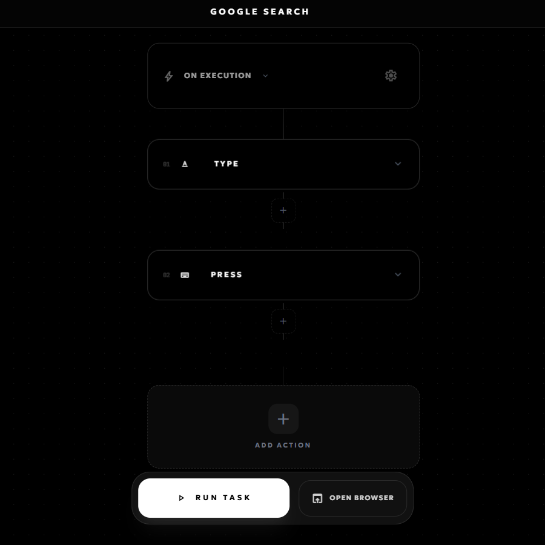

<!-- generated -->

# Doppelganger

1-Click installation template for Doppelganger on Easypanel

## Description

Doppelganger (Figranium) is a self-hosted browser automation and scraping platform built on Playwright. It offers a visual task editor, structured JSON task format, and execution modes for simple scraping to complex, human-like browser interactions. Includes noVNC for remote browser viewing.

## Instructions

Open your app domain to access the Doppelganger web interface and create your first automation task.
Data persistence is enabled in the mounted `/app/data` volume and update to a newer image tag when available.

## Benefits

- Self-Hosted Automation: Run browser automation and scraping entirely on your own infrastructure
- Visual Task Editor: Build and manage tasks without writing code
- Playwright-Powered: Reliable, modern browser automation with human-like interactions
- Remote Viewing: noVNC support to watch and debug browser sessions

## Features

- Visual Editor: Create and edit automation tasks in a structured UI
- JSON Task Format: Portable, version-controlled task definitions
- noVNC: Browser-based VNC client for remote session viewing
- Advanced Modes: From simple scraping to complex multi-step flows

## Links

- [Website](https://doppelgangerdev.com)
- [Documentation](https://figranium.dev/docs/overview)
- [GitHub](https://github.com/mnemosynestack/doppelganger)
- [Template Source](https://github.com/easypanel-io/templates/tree/main/templates/doppelganger)

## Options

Name | Description | Required | Default Value
-|-|-|-
App Service Name | - | yes | doppelganger
App Service Image | - | yes | mnemosyneai/doppelganger:v0.12.2

## Screenshots

## Change Log

- 2026-03-10 – First Release
- 2026-04-29 – Version bumped to v0.12.2

## Contributors

- [Ahson Shaikh](https://github.com/Ahson-Shaikh)
