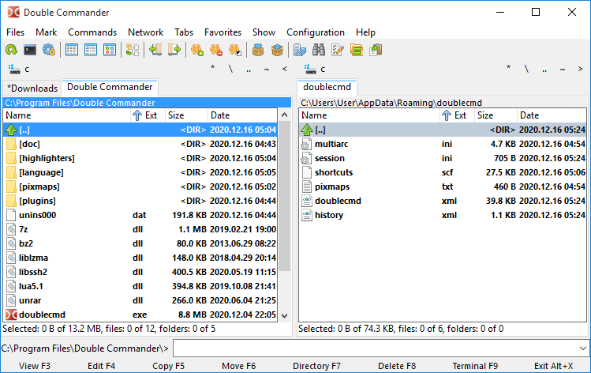

<!-- generated -->

# Double Commander

1-Click installation template for Double Commander on Easypanel

## Description

A cross-platform open-source file manager with two panels side by side. It is inspired by Total Commander and features a modern interface with extensive file management capabilities.

## Benefits

- Dual Panel: Two-panel file management interface
- Cross-Platform: Works on multiple operating systems
- Feature-Rich: Extensive file management capabilities
- Open Source: Free and open-source file manager

## Features

- File Management: Advanced file operations and management
- FTP Support: Built-in FTP client
- Archive Support: Handle various archive formats
- Search: Powerful file search capabilities
- Customization: Highly customizable interface

## Links

- [GitHub](https://github.com/doublecmd/doublecmd)
- [Docker Hub](https://hub.docker.com/r/linuxserver/doublecommander)
- [Website](https://doublecmd.sourceforge.io)
- [Template Source](https://github.com/easypanel-io/templates/tree/main/templates/doublecommander)

## Options

Name | Description | Required | Default Value
-|-|-|-
App Service Name | - | yes | doublecommander
App Service Image | - | yes | lscr.io/linuxserver/doublecommander:version-9bcf3fdc

## Screenshots

## Change Log

- 2025-05-07 – Initial release
- 2026-04-29 – Version bumped to version-9bcf3fdc

## Contributors

- [Ahson Shaikh](https://github.com/Ahson-Shaikh)
