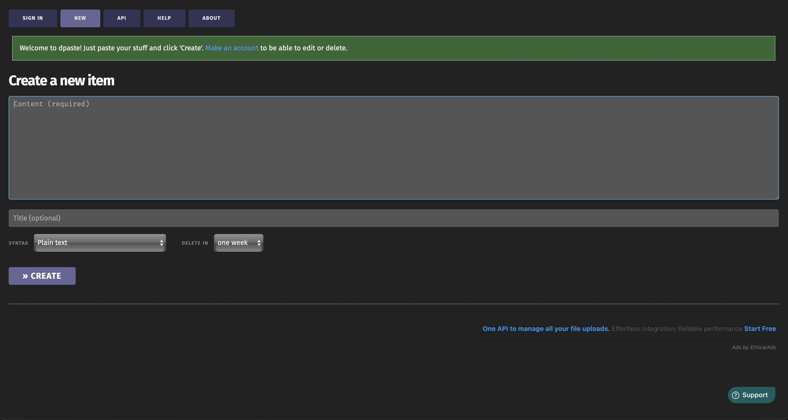

<!-- generated -->

# dPaste

1-Click installation template for dPaste on Easypanel

## Description

dPaste is a simple and lightweight pastebin service that allows you to share text snippets, code, and other content quickly. It provides a clean interface for creating, sharing, and managing pastes with support for syntax highlighting and expiration times.

## Instructions

After installation, access the web interface through the provided domain to start creating and sharing pastes.

## Benefits

- Simple Sharing: Quickly share code snippets and text with others.
- Self-Hosted: Host your own pastebin service for complete control.
- SQLite Storage: Lightweight database storage for your pastes.
- Clean Interface: User-friendly interface for creating and viewing pastes.
- Easy Deployment: Simple setup with Docker and persistent storage.

## Features

- Text Sharing: Share text snippets and code easily.
- Syntax Highlighting: Support for code syntax highlighting.
- Persistent Storage: SQLite database for reliable paste storage.
- Web Interface: Clean web interface for managing pastes.
- Docker Support: Easy deployment with Docker container.

## Links

- [Github](https://github.com/DarrenOfficial/dpaste)
- [Template Source](https://github.com/easypanel-io/templates/tree/main/templates/dpaste)

## Options

Name | Description | Required | Default Value
-|-|-|-
App Service Name | - | yes | dpaste
App Service Image | - | yes | darrenofficial/dpaste:64068f7a

## Screenshots

## Change Log

- 2025-04-10 – First Release
- 2026-04-29 – Version bumped to 64068f7a

## Contributors

- [Ahson Shaikh](https://github.com/Ahson-Shaikh)
