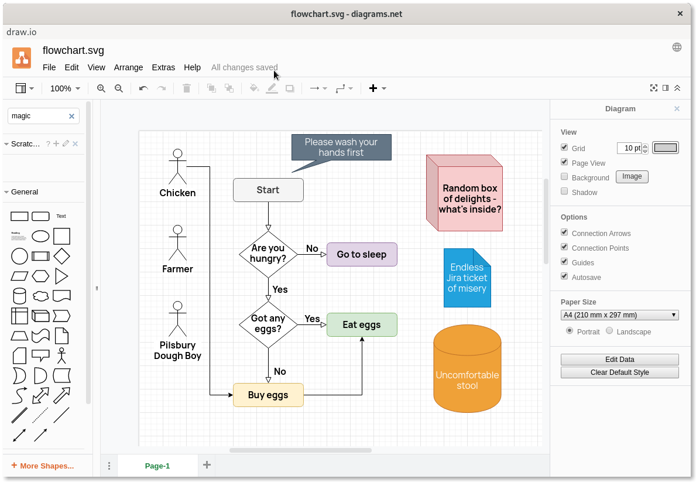

<!-- generated -->

# Draw.io

1-Click installation template for Draw.io on Easypanel

## Description

Draw.io is a versatile, self-hosted diagramming tool designed for individuals and teams. It provides an intuitive, drag-and-drop interface for creating flowcharts, network diagrams, UML diagrams, and more. Draw.io supports integrations with various cloud storage solutions such as Google Drive, OneDrive, and local storage for easy file management. With a focus on simplicity and functionality, Draw.io enables seamless collaboration and offline access, ensuring that users can work efficiently. Its rich library of shapes, templates, and customization options caters to a wide range of diagramming needs.

## Benefits

- Intuitive Diagram Creation: Draw.io offers a user-friendly interface with drag-and-drop functionality for easy and efficient diagram creation, suitable for all skill levels.
- Cross-Platform Compatibility: Draw.io ensures a consistent experience across web and desktop applications, allowing seamless access and collaboration from any device.
- Cloud and Local Storage Integration: Draw.io supports syncing and saving diagrams to popular cloud services like Google Drive and OneDrive or directly to local storage for flexibility.

## Features

- Rich Shape Library: Draw.io provides a comprehensive library of shapes, icons, and templates to help users create professional-quality diagrams effortlessly.
- Offline Access: Draw.io allows users to create and edit diagrams without an internet connection, ensuring uninterrupted productivity.
- Collaboration Features: Draw.io supports real-time collaboration, enabling teams to work on diagrams together and streamline their workflows.
- Customizable Interface: Draw.io offers various customization options, including themes and layout preferences, to tailor the user experience to individual needs.

## Links

- [Website](https://drawio-app.com/)
- [Documentation](https://github.com/jgraph/drawio/wiki)
- [Github](https://github.com/jgraph/drawio)
- [Docker Guide](https://www.drawio.com/blog/diagrams-docker-app)
- [Template Source](https://github.com/easypanel-io/templates/tree/main/templates/drawio)

## Options

Name | Description | Required | Default Value
-|-|-|-
App Service Name | - | yes | drawio
App Service Image | - | yes | jgraph/drawio

## Screenshots

## Change Log

- 2024-01-07 – First Release

## Contributors

- [Ahson Shaikh](https://github.com/Ahson-Shaikh)
