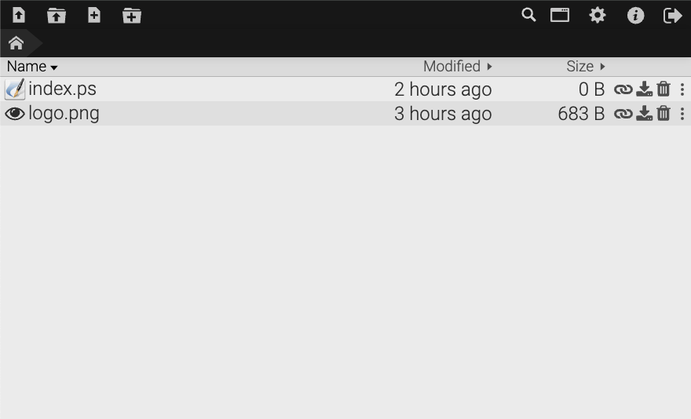

<!-- generated -->

# Droppy

1-Click installation template for Droppy on Easypanel

## Description

Droppy is a self-hosted file storage and sharing server with a modern, web-based interface. It allows you to securely upload, manage, and share files and folders from any device with a browser. Droppy supports drag-and-drop uploads, real-time updates, and previews for a variety of file types including images, videos, and documents. With its user-friendly interface and robust feature set, Droppy is ideal for personal or team file management. It is lightweight, written in Node.js, and supports customization through environment variables and themes.

## Benefits

- Secure File Storage: Droppy offers a self-hosted platform for securely storing files, ensuring your data remains private and under your control.
- Real-Time File Management: Droppy provides real-time updates to file operations, allowing for an interactive and seamless file management experience.
- Cross-Platform Accessibility: Access and manage your files from any device with a web browser, making it convenient and flexible for users on various platforms.

## Features

- Drag-and-Drop Uploads: Upload files and folders with a simple drag-and-drop interface, making it easy to use even for non-technical users.
- File Previews: Preview a wide range of file types directly in the browser, including images, videos, and documents.
- Customizable Interface: Personalize Droppy with themes and configuration options to match your preferences or branding needs.
- Real-Time Collaboration: Collaborate with others by sharing links or folders in real time, making it an excellent tool for team file management.
- Lightweight and Efficient: Droppy is written in Node.js, making it lightweight and efficient, suitable for deployment on low-resource servers.

## Links

- [Documentation](https://github.com/silverwind/droppy/wiki)
- [Github](https://github.com/silverwind/droppy)
- [Website](https://www.droppyjs.com/)
- [Template Source](https://github.com/easypanel-io/templates/tree/main/templates/droppy)

## Options

Name | Description | Required | Default Value
-|-|-|-
App Service Name | - | yes | droppy
App Service Image | - | yes | silverwind/droppy:12.2.0

## Screenshots

## Change Log

- 2025-01-22 – First Release

## Contributors

- [Ahson Shaikh](https://github.com/Ahson-Shaikh)
