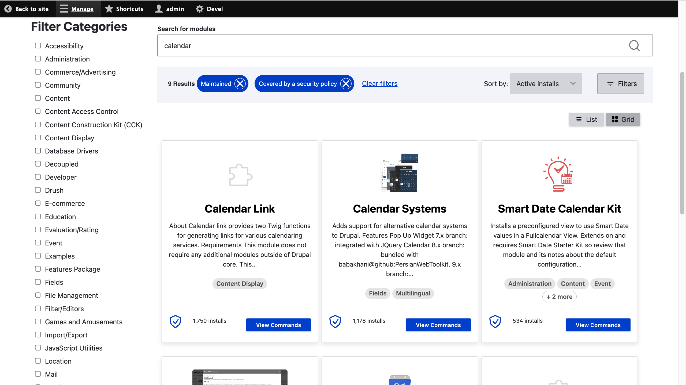

<!-- generated -->

# Drupal

1-Click installation template for Drupal on Easypanel

## Description

Drupal is a powerful open-source content management system (CMS) designed to help you create and manage complex, dynamic websites with ease. Drupal is highly customizable, offering robust tools for managing content, users, permissions, and workflows. It supports custom themes, modules, and integrations, enabling you to create tailored experiences for any type of website, from blogs and portfolios to eCommerce platforms and enterprise-level solutions. Drupal prioritizes flexibility, scalability, and security, making it a preferred choice for developers, businesses, and organizations worldwide.

## Benefits

- Open-Source & Secure: Drupal is an open-source CMS with an active community that ensures robust security updates, making it ideal for enterprise-grade applications.
- Highly Customizable: From themes and layouts to modules and APIs, Drupal allows extensive customization to suit any website needs.
- Scalable & Flexible: Drupal is built to scale for websites of any size, handling high traffic and content-heavy platforms seamlessly.
- Multilingual Support: Out-of-the-box support for multiple languages enables you to create localized content and reach a global audience.
- Advanced Content Management: Drupal provides powerful content authoring tools, workflows, and permissions to streamline content management for teams.

## Features

- Modular Architecture: Drupal's modular design enables developers to extend functionality using community-contributed or custom-built modules.
- Content Workflows: Drupal supports advanced content workflows with features like drafts, revisions, and role-based publishing permissions.
- API-First Approach: Drupal supports headless CMS architectures, enabling you to build decoupled applications using its powerful APIs.
- Theming System: Drupal offers a robust theming system for creating responsive, accessible, and visually appealing designs.
- Enterprise-Level Performance: Drupal is optimized for enterprise performance, supporting caching, CDN integration, and database clustering.
- SEO-Friendly: Built-in SEO tools and customizable metadata help improve search engine visibility for Drupal websites.

## Links

- [Website](https://www.drupal.org/)
- [Documentation](https://www.drupal.org/docs)
- [Github](https://github.com/drupal/drupal)
- [Template Source](https://github.com/easypanel-io/templates/tree/main/templates/drupal)

## Options

Name | Description | Required | Default Value
-|-|-|-
App Service Name | - | yes | drupal
App Service Image | - | yes | drupal:10.4-apache

## Screenshots

## Change Log

- 2024-10-12 – First release
- 2025-01-09 – Version bumped to 10.4-apache

## Contributors

- [Ahson Shaikh](https://github.com/Ahson-Shaikh)
