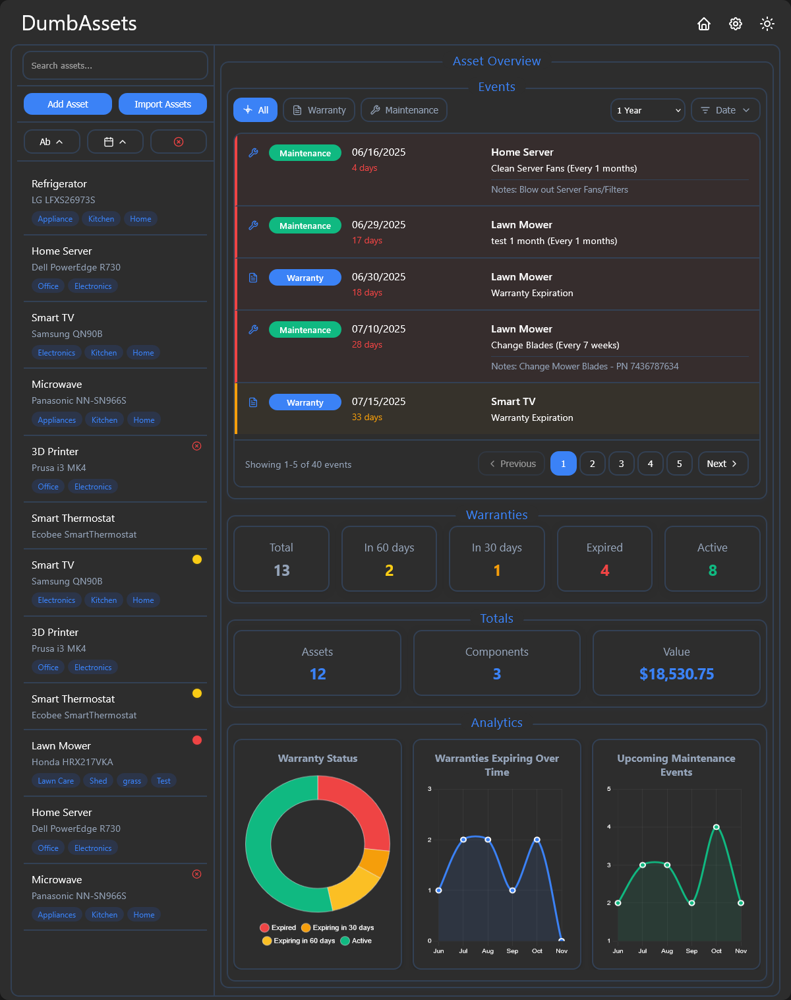

<!-- generated -->

# DumbAssets

1-Click installation template for DumbAssets on Easypanel

## Description

DumbAssets is a self-hosted asset management service that provides secure file storage, organization, and sharing capabilities. It features PIN protection, configurable access controls, and notification integration. Perfect for teams and organizations that need centralized asset management.

## Benefits

- Asset Management: Centralized file storage, organization, and sharing with secure access controls and user management.
- PIN Protection: Optional PIN-based access control for additional security and controlled access to assets.
- File Organization: Organize files with categories, tags, and metadata for efficient asset management and retrieval.
- Notification Integration: Integration with Apprise for notifications about asset changes and system events.

## Features

- Web Interface: Clean, responsive web interface for asset management.
- PIN Protection: Optional PIN-based access control for security.
- File Upload: Secure file upload with size and type restrictions.
- File Organization: Categorize and organize files with metadata.
- Access Control: Configurable access controls and permissions.
- CORS Support: Configurable cross-origin resource sharing.
- Notification Integration: Integration with Apprise notification service.
- Data Persistence: All assets and metadata persist across restarts.

## Links

- [Website](https://www.dumbware.io/DumbAssets)
- [Documentation](https://github.com/dumbwareio/dumbassets#readme)
- [GitHub](https://github.com/dumbwareio/dumbassets)
- [Template Source](https://github.com/easypanel-io/templates/tree/main/templates/dumbassets)

## Options

Name | Description | Required | Default Value
-|-|-|-
App Service Name | - | yes | dumbassets
App Service Image | - | yes | dumbwareio/dumbassets:1.0.11

## Screenshots

## Change Log

- 2025-09-25 – First release

## Contributors

- [Ahson Shaikh](https://github.com/Ahson-Shaikh)
