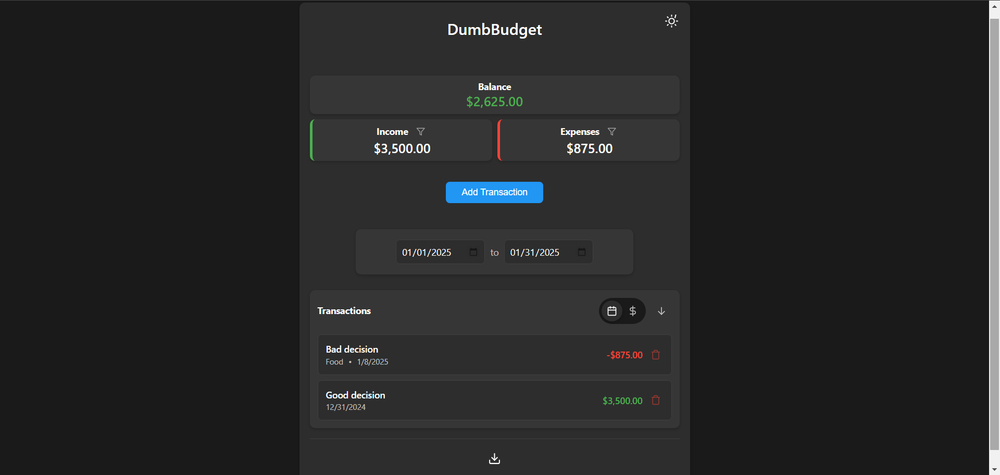

<!-- generated -->

# DumbBudget

1-Click installation template for DumbBudget on Easypanel

## Description

DumbBudget is a simple, self-hosted personal budgeting app from DumbWare.io. Track income and expenses with categories, PIN protection, multi-currency support, CSV export, and a responsive PWA UI. Data persists under /app/data.

## Instructions

**BASE_URL** is set to your primary HTTPS domain—required for correct links and
auth behind a reverse proxy.
**DUMBBUDGET_PIN:** Leave the template default empty for open access (no PIN
gate), or set a PIN in the form / env to require it at login (see upstream
security notes on rate limits and lockouts).
**SITE_TITLE** appears in the UI header; **INSTANCE_NAME** is optional metadata
for multi-instance setups (matches upstream docker-compose).
**CURRENCY** must be a supported ISO code (see documentation link). After
deploy, open the app and complete any first-run prompts.

## Benefits

- Budget Management: Track income, expenses, and savings with intuitive budget management tools and financial insights.
- PIN Protection: Optional PIN-based access control for additional security and privacy protection of your financial data.
- Multi-Currency Support: Support for different currencies to match your local financial environment and preferences.
- Self-Hosted: Complete control over your financial data with no external dependencies or data sharing with third parties.

## Features

- Expense Tracking: Track and categorize your daily expenses and purchases.
- Income Management: Record and monitor your income sources and patterns.
- Budget Planning: Create and manage budgets for different categories.
- Financial Reports: Generate reports and insights about your spending habits.
- PIN Protection: Optional PIN-based access control for security.
- Multi-Currency: Support for different currencies and exchange rates.
- Data Persistence: All financial data persists across container restarts.
- Web Interface: Clean, responsive web interface for budget management.

## Links

- [Website](https://dumbware.io)
- [Documentation](https://github.com/dumbwareio/dumbbudget/blob/main/README.md)
- [GitHub](https://github.com/dumbwareio/dumbbudget)
- [Docker Hub](https://hub.docker.com/r/dumbwareio/dumbbudget)
- [Template Source](https://github.com/easypanel-io/templates/tree/main/templates/dumbbudget)

## Options

Name | Description | Required | Default Value
-|-|-|-
App Service Name | - | yes | dumbbudget
App Service Image | - | yes | dumbwareio/dumbbudget:d44543bf67ecedb416138ac4de93759d3a324999
DUMBBUDGET_PIN | Optional. Empty = no PIN. Set a numeric PIN to protect the app at login. | yes | 
Currency code | ISO currency code (USD, EUR, GBP, …). See README for full supported list. | yes | USD
SITE_TITLE | Title shown in the app UI (upstream default DumbBudget). | yes | DumbBudget
INSTANCE_NAME | Optional label for this instance/account when running multiple deployments. | yes | 

## Screenshots

## Change Log

- 2025-09-26 – First release (d44543bf67ecedb416138ac4de93759d3a324999)
- 2026-03-20 – Screenshot, website/docs links, SITE_TITLE & INSTANCE_NAME env parity, configurable PIN/currency/titles

## Contributors

- [Ahson Shaikh](https://github.com/Ahson-Shaikh)
