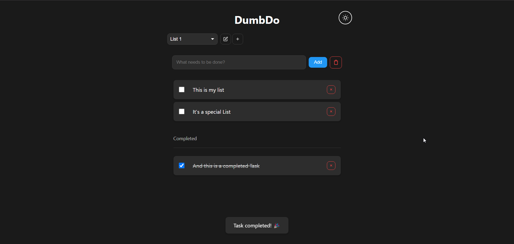

<!-- generated -->

# Dumbdo

1-Click installation template for Dumbdo on Easypanel

## Description

DumbDo is a stupidly simple todo list application that just works. No complex database, no unnecessary features - just todos. It features a clean, minimal interface with dark/light mode support, file-based storage, and PIN protection. Built with the &quot;Dumb&quot; design system principles, it&#39;s fast, lightweight, and fully responsive with PWA support.

## Benefits

- Stupidly Simple: No complex database, no unnecessary features - just todos. Built with the "Dumb" design system principles for maximum simplicity and reliability.
- Clean Minimal Interface: Clean, minimal interface with dark/light mode support and system preference detection for a distraction-free todo management experience.
- File-Based Storage: Simple file-based storage using JSON files - todos persist between sessions without complex database setup or maintenance requirements.
- PIN Protection: Optional PIN protection (4-10 digits) to secure your todos while keeping the interface simple and accessible.

## Features

- Dark/Light Mode: Built-in dark and light mode with automatic system preference detection for comfortable viewing in any environment.
- Fully Responsive Design: Mobile-first responsive design that works perfectly on desktop, tablet, and mobile devices with touch-friendly interface.
- PWA Support: Progressive Web App support allowing you to install DumbDo as a native app on your device for quick access.
- File-Based Storage: Simple JSON file storage at `/app/data/todos.json` - easy to backup, restore, and migrate your todos between instances.
- Fast and Lightweight: Minimal resource usage with fast performance - no complex dependencies or heavy frameworks, just pure efficiency.
- Single List Mode: Optional single list mode to show all todos without the list selector for even simpler todo management.

## Links

- [Website](https://www.dumbware.io/DumbDo)
- [GitHub](https://github.com/dumbwareio/dumbdo)
- [Docker Hub](https://hub.docker.com/r/dumbwareio/dumbdo)
- [Template Source](https://github.com/easypanel-io/templates/tree/main/templates/dumbdo)

## Options

Name | Description | Required | Default Value
-|-|-|-
App Service Name | - | yes | dumbdo
App Service Image | Dumbdo Docker image | yes | dumbwareio/dumbdo:af4532890ed0613d4cb4a35931d436cea63180ff

## Screenshots

## Change Log

- 2025-09-11 – Initial Template Release (af4532890ed0613d4cb4a35931d436cea63180ff)

## Contributors

- [Ahson Shaikh](https://github.com/Ahson-Shaikh)
