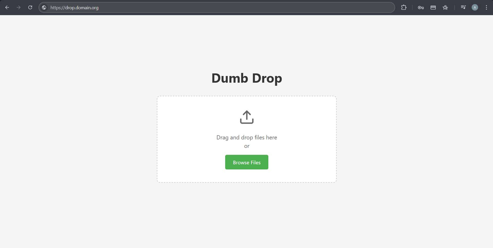

<!-- generated -->

# DumbDrop

1-Click installation template for DumbDrop on Easypanel

## Description

DumbDrop is a simple file sharing service for quick file uploads and downloads. It provides a clean web interface for sharing files with optional PIN protection and configurable file size limits. Perfect for temporary file sharing and quick document distribution.

## Features

- Web Interface: Clean, responsive web interface for uploading and managing files.
- PIN Protection: Optional PIN-based access control for additional security.
- File Size Limits: Configurable maximum file size limits to control storage usage.
- Auto Upload: Option to automatically upload files without clicking upload button.
- Direct Links: Generate direct download links for easy file sharing.
- Persistent Storage: Files are stored in persistent volumes and survive container restarts.

## Links

- [Website](https://www.dumbware.io/DumbDrop)
- [Documentation](https://github.com/dumbwareio/dumbdrop#readme)
- [GitHub](https://github.com/dumbwareio/dumbdrop)
- [Container Registry](https://hub.docker.com/r/dumbwareio/dumbdrop)
- [Template Source](https://github.com/easypanel-io/templates/tree/main/templates/dumbdrop)

## Options

Name | Description | Required | Default Value
-|-|-|-
App Service Name | - | yes | dumbdrop
App Service Image | - | yes | dumbwareio/dumbdrop:sha-ff8f813f493e89c7da056e7a3101ce2ef48e3960

## Screenshots

## Change Log

- 2025-09-24 – First release (sha-54cdf4be36b85a7146685841c567cb6b4e96b69e)
- 2026-04-29 – Version bumped to sha-ff8f813f493e89c7da056e7a3101ce2ef48e3960

## Contributors

- [Ahson Shaikh](https://github.com/Ahson-Shaikh)
