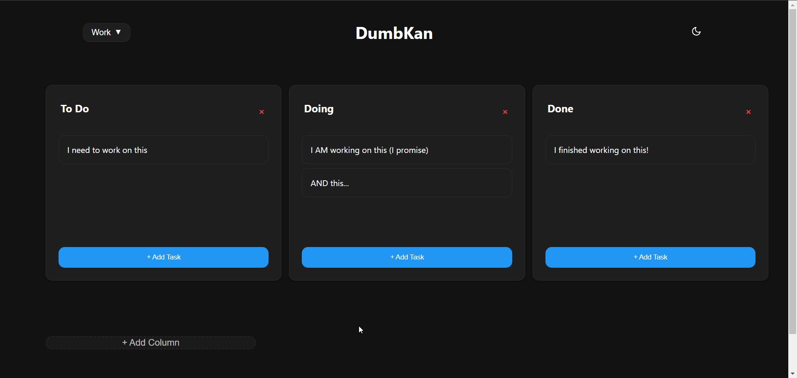

<!-- generated -->

# DumbKan

1-Click installation template for DumbKan on Easypanel

## Description

DumbKan is a simple, self-hosted Kanban board application for project management and task organization. It provides a clean interface for creating boards, managing tasks, and collaborating on projects. Perfect for teams and individuals who need a lightweight project management solution.

## Benefits

- Project Management: Simple and effective Kanban boards for organizing tasks and managing project workflows.
- Team Collaboration: Share boards with team members for collaborative project management and task tracking.
- Visual Organization: Drag-and-drop interface for intuitive task management and visual project organization.
- Self-Hosted: Complete control over your project data with no external dependencies or data sharing.

## Features

- Kanban Boards: Create and manage multiple Kanban boards for different projects.
- Task Management: Create, edit, and organize tasks with descriptions and labels.
- Drag and Drop: Intuitive drag-and-drop interface for moving tasks between columns.
- Board Sharing: Share boards with team members for collaborative work.
- Column Management: Customize board columns to match your workflow.
- Task Labels: Organize tasks with custom labels and categories.
- Data Persistence: All boards and tasks persist across container restarts.
- Web Interface: Clean, responsive web interface accessible from any device.

## Links

- [Website](https://www.dumbware.io/DumbKan)
- [Documentation](https://github.com/dumbwareio/dumbkan#readme)
- [GitHub](https://github.com/dumbwareio/dumbkan)
- [Template Source](https://github.com/easypanel-io/templates/tree/main/templates/dumbkan)

## Options

Name | Description | Required | Default Value
-|-|-|-
App Service Name | - | yes | dumbkan
App Service Image | - | yes | dumbwareio/dumbkan:nightly-20250303-051955

## Screenshots

## Change Log

- 2025-09-26 – First release

## Contributors

- [Ahson Shaikh](https://github.com/Ahson-Shaikh)
