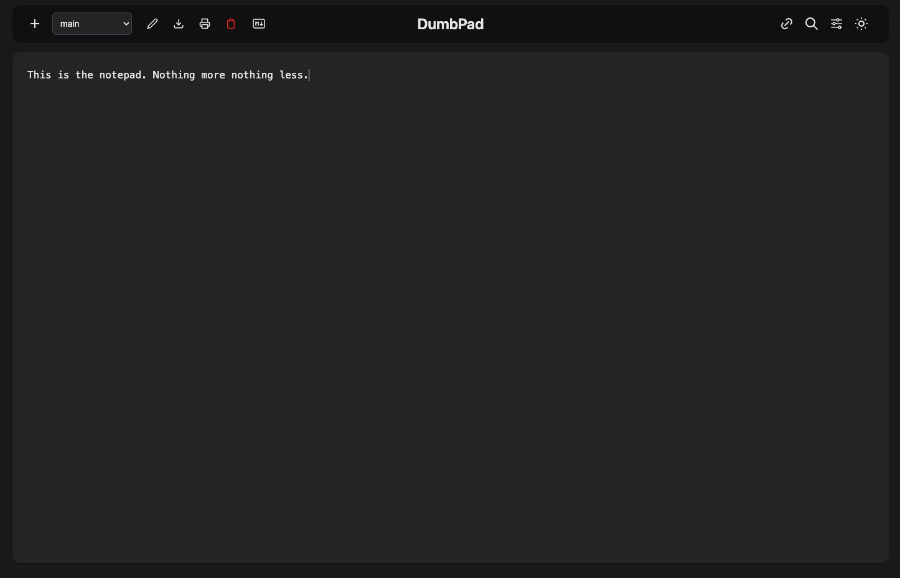

<!-- generated -->

# DumbPad

1-Click installation template for DumbPad on Easypanel

## Description

DumbPad is a simple note-taking application for quick text storage and sharing. It provides a clean web-based text editor with optional PIN protection for secure note management. Perfect for quick notes, temporary text storage, and collaborative text editing.

## Benefits

- Simple Note Taking: Clean, distraction-free interface for quick note creation and editing.
- Optional Security: Optional PIN protection to control access to your notes.
- Persistent Storage: Notes are stored in persistent volumes and survive container restarts.
- No Database Required: Stateless service that stores notes directly without requiring a database.

## Features

- Web Interface: Clean, responsive web interface for creating and editing notes.
- PIN Protection: Optional PIN-based access control for additional security.
- Auto Save: Notes are automatically saved as you type.
- URL Sharing: Each note gets a unique URL for easy sharing.
- Persistent Storage: Notes survive container restarts and updates.
- Simple Interface: Minimal, distraction-free writing environment.

## Links

- [Website](https://www.dumbware.io/DumbPad)
- [Documentation](https://github.com/dumbwareio/dumbpad#readme)
- [GitHub](https://github.com/dumbwareio/dumbpad)
- [Template Source](https://github.com/easypanel-io/templates/tree/main/templates/dumbpad)

## Options

Name | Description | Required | Default Value
-|-|-|-
App Service Name | - | yes | dumbpad
App Service Image | - | yes | dumbwareio/dumbpad:1.0.5

## Screenshots

## Change Log

- 2025-09-24 – First release (1.0.4)
- 2026-04-29 – Version bumped to 1.0.5

## Contributors

- [Ahson Shaikh](https://github.com/Ahson-Shaikh)
