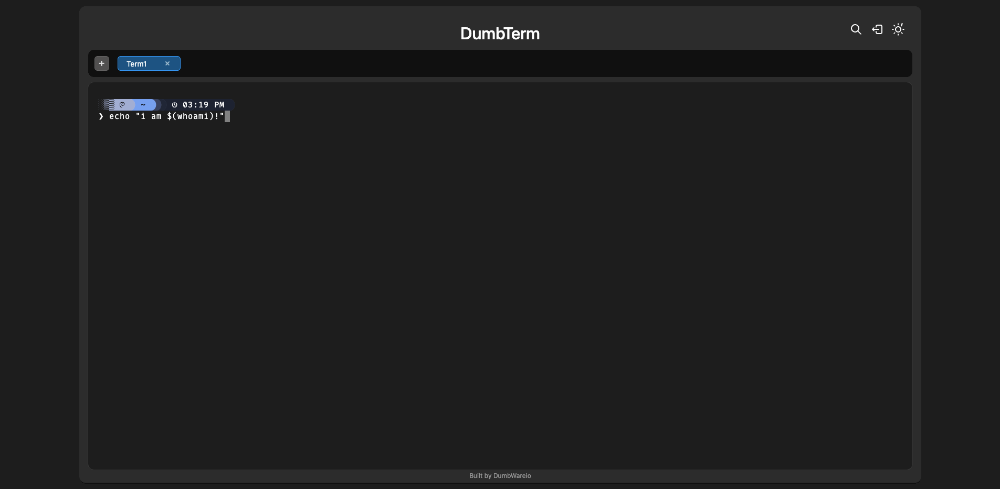

<!-- generated -->

# DumbTerm

1-Click installation template for DumbTerm on Easypanel

## Description

DumbTerm is a web-based terminal emulator that provides secure terminal access through your browser. It features PIN protection, session management, and configurable security settings. Perfect for remote server access, development environments, and system administration tasks.

## Benefits

- Web-Based Terminal: Access your server terminal directly through your web browser without additional software installation.
- Secure Access: PIN protection and session management for secure terminal access.
- Cross-Platform: Works on any device with a web browser, including mobile devices.
- No Installation Required: No need to install SSH clients or terminal software on client devices.

## Features

- Web Interface: Clean, responsive web interface for terminal access.
- PIN Protection: Optional PIN-based access control for additional security.
- Session Management: Configurable session duration and lockout protection.
- Starship Integration: Optional Starship prompt for enhanced terminal experience.
- Timezone Configuration: Configurable timezone for proper time display.
- CORS Support: Configurable cross-origin resource sharing settings.
- Persistent Storage: Configuration and data persist across container restarts.
- Root Access: Runs with root privileges for full system access.

## Links

- [Website](https://www.dumbware.io/DumbTerm)
- [Documentation](https://github.com/dumbwareio/dumbterm#readme)
- [GitHub](https://github.com/dumbwareio/dumbterm)
- [Template Source](https://github.com/easypanel-io/templates/tree/main/templates/dumbterm)

## Options

Name | Description | Required | Default Value
-|-|-|-
App Service Name | - | yes | dumbterm
App Service Image | - | yes | dumbwareio/dumbterm:1.2.0

## Screenshots

## Change Log

- 2025-09-26 – First release (v1.2.0)

## Contributors

- [Ahson Shaikh](https://github.com/Ahson-Shaikh)
