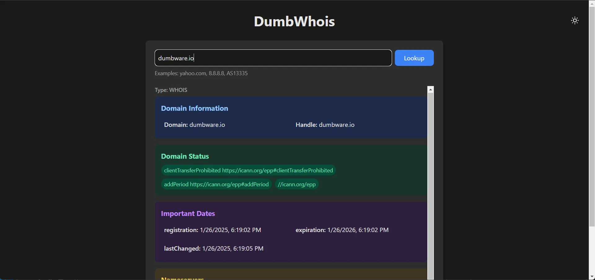

<!-- generated -->

# DumbWhois

1-Click installation template for DumbWhois on Easypanel

## Description

DumbWhois is a simple WHOIS lookup service for domain information queries. It provides both a web interface and API endpoint for retrieving domain registration details, nameserver information, and other domain-related data. Perfect for developers and system administrators who need quick domain lookups.

## Benefits

- Domain Information: Quick access to domain registration details, nameservers, and contact information for any domain.
- API Access: RESTful API endpoint for programmatic domain lookups and integration with other services.
- CORS Support: Configurable cross-origin resource sharing for web application integration.
- No Storage Required: Stateless service that performs real-time lookups without storing data.

## Features

- Web Interface: Clean, responsive web interface for performing WHOIS lookups.
- REST API: RESTful API endpoint for programmatic access to WHOIS data.
- CORS Configuration: Configurable CORS settings for web application integration.
- Real-time Lookups: Performs live WHOIS queries for up-to-date domain information.
- JSON Response: API returns structured JSON data for easy integration.
- Simple Setup: Easy deployment with minimal configuration required.

## Links

- [Website](hhttps://www.dumbware.io/DumbWhoIs)
- [Documentation](https://github.com/dumbwareio/dumbwhois#readme)
- [GitHub](https://github.com/dumbwareio/dumbwhois)
- [Template Source](https://github.com/easypanel-io/templates/tree/main/templates/dumbwhois)

## Options

Name | Description | Required | Default Value
-|-|-|-
App Service Name | - | yes | dumbwhois
App Service Image | - | yes | dumbwareio/dumbwhois:latest

## Screenshots

## Change Log

- 2025-09-24 – First release

## Contributors

- [Ahson Shaikh](https://github.com/Ahson-Shaikh)
