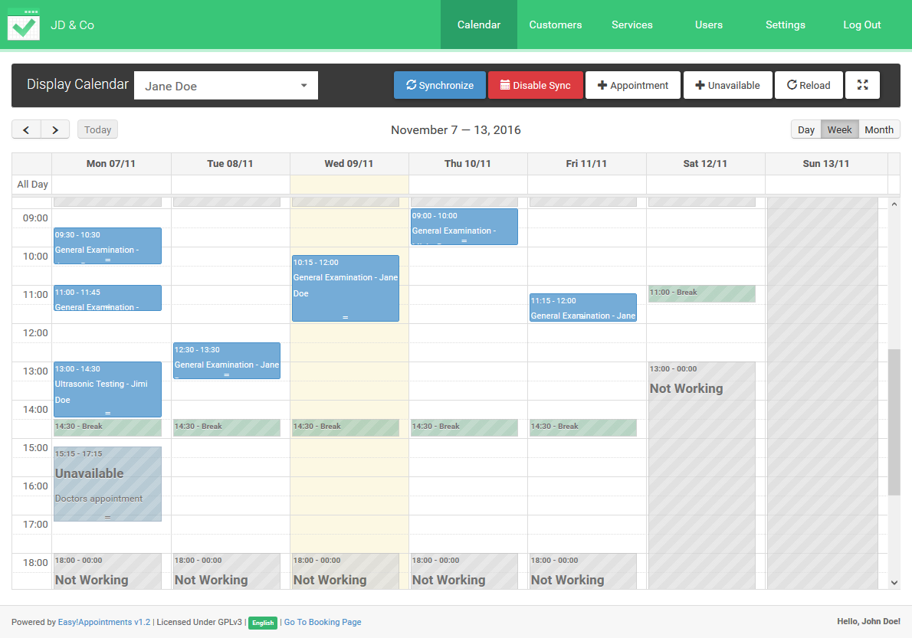

<!-- generated -->

# EasyAppointments

1-Click installation template for EasyAppointments on Easypanel

## Description

EasyAppointments is an open-source, self-hosted scheduling platform designed to help businesses manage appointments seamlessly. It enables organizations to handle booking, customer management, and service scheduling with ease. With an intuitive interface and robust customization options, EasyAppointments supports integrations, multi-language capabilities, and detailed reporting, making it a versatile solution for appointment scheduling.

## Benefits

- Simplified Appointment Scheduling: EasyAppointments provides an intuitive platform for managing appointments and schedules efficiently.
- Customizable and Scalable: EasyAppointments offers a range of customization options, including themes and integrations, to grow with your business needs.
- Multi-Language Support: Operate in multiple languages to cater to diverse customer bases.

## Features

- Online Appointment Booking: Allow customers to book appointments online, reducing manual intervention.
- Customer and Service Management: Manage customer profiles and service details efficiently in one place.
- Calendar Synchronization: Sync with Google Calendar or other platforms for seamless scheduling.
- Reporting and Analytics: Generate detailed reports to track appointments, revenue, and customer trends.
- Mobile-Friendly Interface: A responsive interface ensures accessibility across devices.

## Links

- [Github](https://github.com/alextselegidis/easyappointments)
- [Documentation](https://easyappointments.org/)
- [Demo](https://demo.easyappointments.org/)
- [Template Source](https://github.com/easypanel-io/templates/tree/main/templates/easyappointments)

## Options

Name | Description | Required | Default Value
-|-|-|-
App Service Name | - | yes | easyappointments
App Service Image | - | yes | alextselegidis/easyappointments:1.5.0

## Screenshots

## Change Log

- 2025-01-20 – First Release

## Contributors

- [Ahson Shaikh](https://github.com/Ahson-Shaikh)
