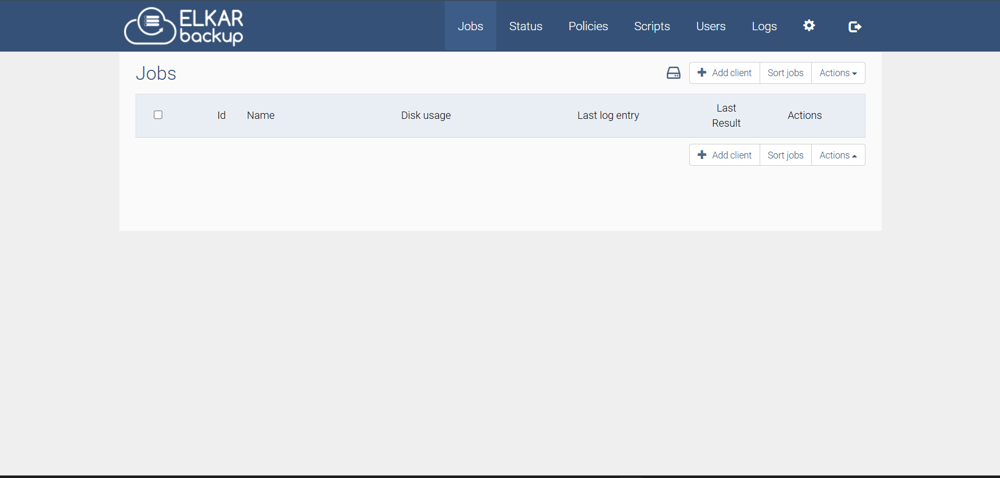

<!-- generated -->

# ElkarBackup

1-Click installation template for ElkarBackup on Easypanel

## Description

ElkarBackup is a robust open-source backup management system designed to streamline data protection and recovery for diverse environments. With an intuitive web-based interface and extensive automation capabilities, it simplifies backup scheduling and execution. ElkarBackup supports various storage backends and ensures reliable backup operations with robust monitoring and reporting features. Whether you&#39;re managing personal data or enterprise-scale systems, ElkarBackup offers an efficient and user-friendly solution for safeguarding your critical information.

## Instructions

Login using root/root, custom settingss can be configured with the provided envs.

## Benefits

- Centralized Backup Management: ElkarBackup provides a centralized platform for managing backups, ensuring data protection across all devices and environments with minimal effort.
- User-Friendly Interface: The intuitive web interface simplifies configuration, monitoring, and management of backups, making it accessible even for users with limited technical expertise.
- Flexible Scheduling: ElkarBackup's advanced scheduling options allow users to automate backup tasks based on their specific needs, reducing manual intervention.
- Cost-Effective Solution: As an open-source tool, ElkarBackup offers a cost-effective solution for backup management, eliminating the need for expensive proprietary software.

## Features

- Multi-Backend Support: ElkarBackup supports various storage backends, including local storage, network shares, and cloud services, ensuring flexibility in choosing storage options.
- Automation and Scheduling: Automate backup jobs with cron-like scheduling, ensuring regular and reliable backups without manual intervention.
- Robust Monitoring and Reporting: Comprehensive monitoring and reporting tools enable users to track backup performance, detect failures, and ensure data integrity.
- Secure Data Handling: ElkarBackup ensures secure backup and recovery processes, with options to encrypt data and limit access through role-based permissions.

## Links

- [Website](https://elkarbackup.github.io)
- [Documentation](https://elkarbackup.github.io/elkarbackup/)
- [Github](https://github.com/elkarbackup/elkarbackup)
- [Template Source](https://github.com/easypanel-io/templates/tree/main/templates/elkarbackup)

## Options

Name | Description | Required | Default Value
-|-|-|-
App Service Name | - | yes | elkarbackup
App Service Image | - | yes | elkarbackup/elkarbackup:2.1.0

## Screenshots

## Change Log

- 2024-11-17 – Template Release
- 2025-01-11 – Version bumped to 2.1.0

## Contributors

- [Ahson Shaikh](https://github.com/Ahson-Shaikh)
