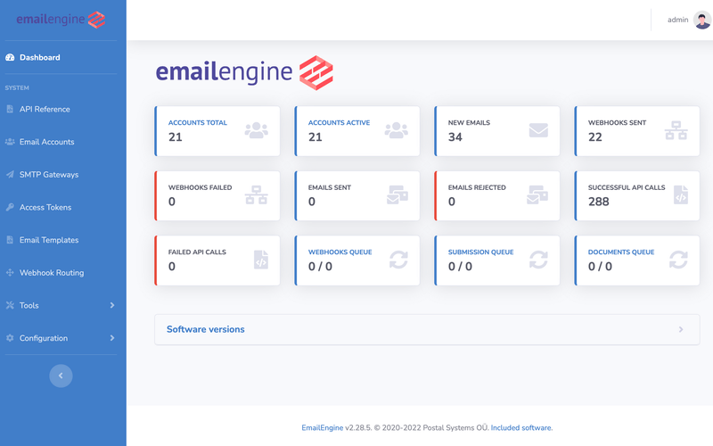

<!-- generated -->

# EmailEngine

1-Click installation template for EmailEngine on Easypanel

## Description

EmailEngine is a powerful email automation and integration tool designed to simplify email processing for applications. It provides a seamless interface for managing IMAP and SMTP connections, allowing applications to send, receive, and process emails efficiently. With built-in webhook support and extensive API capabilities, EmailEngine enables developers to automate email workflows and integrate email functionality effortlessly. Whether handling transactional emails or managing large-scale email operations, EmailEngine offers a reliable and feature-rich solution.

## Instructions

Set the SMTP password for email submissions on the server.

## Benefits

- Seamless Email Integration: EmailEngine provides a robust solution for integrating IMAP and SMTP functionality, allowing applications to manage emails effortlessly.
- Webhook Support: Built-in webhook functionality enables real-time email event tracking, making it easy to trigger automated actions based on incoming or outgoing emails.
- API-Driven Automation: The extensive API allows developers to automate email sending, receiving, and processing without dealing with complex email protocols directly.
- Cost-Effective Solution: As an open-source tool, EmailEngine offers an affordable solution for managing email automation without relying on expensive third-party services.

## Features

- IMAP and SMTP Support: EmailEngine simplifies working with IMAP and SMTP, abstracting complexities and making email handling more efficient.
- Webhook-Driven Processing: Automate email workflows with real-time webhooks for incoming and outgoing emails, reducing manual email processing.
- Advanced Email Parsing: Extract email content, attachments, and metadata easily with built-in parsing tools, enabling better email workflow automation.
- Secure Authentication: Supports OAuth2 and other authentication mechanisms to ensure secure email handling and access control.

## Links

- [Website](https://emailengine.app)
- [Documentation](https://api.emailengine.app/)
- [Github](https://github.com/postalsys/emailengine)
- [Template Source](https://github.com/easypanel-io/templates/tree/main/templates/emailengine)

## Options

Name | Description | Required | Default Value
-|-|-|-
App Service Name | - | yes | emailengine
App Service Image | - | yes | postalsys/emailengine:latest
SMTP Message Submission | - | yes | 2525
IMAP Port | - | yes | 9993
SMTP Password | - | yes | password

## Screenshots

## Change Log

- 2025-02-06 – Template Release

## Contributors

- [Ahson Shaikh](https://github.com/Ahson-Shaikh)
