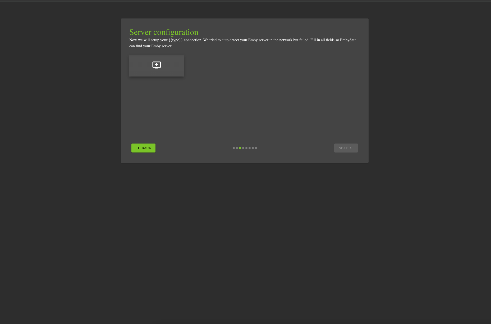

<!-- generated -->

# Emby-Stat

1-Click installation template for Emby-Stat on Easypanel

## Description

Emby-Stat is an advanced statistics and analytics tool for Emby and Jellyfin media servers. It allows you to gain deeper insights into your media library, viewing habits, and server usage. With detailed statistics and customizable reports, Emby-Stat helps you visualize and analyze your media server data effectively. It also provides a user-friendly interface to track playback history, top media consumption trends, and server activity over time. Emby-Stat integrates seamlessly with Emby, giving you the ability to enhance your media management with data-driven decisions.

## Benefits

- Gain Insights into Media Usage: Emby-Stat provides detailed analytics about your media server, helping you understand playback trends, most-watched content, and overall server activity.
- Enhanced Media Management: Use Emby-Stat's statistics to make informed decisions about your media library organization and usage patterns.
- Cross-Platform Integration: Emby-Stat works seamlessly with Emby and Jellyfin servers, giving you the flexibility to use your preferred media server.
- Customizable Reports: Generate reports tailored to your specific needs, such as most-played movies, top TV shows, or user activity summaries.

## Features

- Detailed Media Statistics: Get advanced statistics on your media library, including play counts, top users, and playback times.
- Playback History Tracking: Track the playback history of your media to see when and how content was consumed.
- Analytics Dashboard: Access an intuitive dashboard that visualizes media consumption trends and server activity over time.
- Multi-Server Support: Use Emby-Stat with multiple Emby or Jellyfin servers to consolidate analytics across all your media.

## Links

- [Website](https://embystat.org/)
- [Documentation](https://docs.embystat.org/)
- [Github](https://github.com/mregni/EmbyStat)
- [Template Source](https://github.com/easypanel-io/templates/tree/main/templates/emby-stat)

## Options

Name | Description | Required | Default Value
-|-|-|-
App Service Name | - | yes | emby-stat
App Service Image | - | yes | lscr.io/linuxserver/embystat:latest

## Screenshots

## Change Log

- 2024-12-24 – First release

## Contributors

- [Ahson Shaikh](https://github.com/MuhammadAhsanDonuts)
