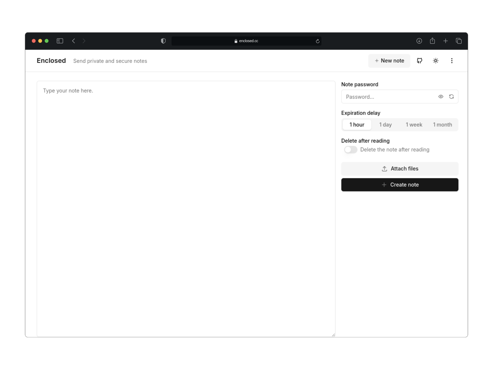

<!-- generated -->

# Enclosed

1-Click installation template for Enclosed on Easypanel

## Description

Enclosed is a minimalist file sharing and URL shortening service. It provides a simple and efficient way to share files and shorten URLs with a clean, modern interface. Perfect for personal or small team use, it offers secure file storage and easy link management.

## Instructions

After installation, access the web interface through the provided domain to start sharing files and shortening URLs.

## Benefits

- File Sharing: Easy and secure file sharing capabilities.
- URL Shortening: Create short, memorable links for long URLs.
- Self-Hosted: Complete control over your data and sharing service.
- Simple Interface: Clean and intuitive user interface.
- Data Persistence: Reliable storage for your shared files and links.

## Features

- File Upload: Upload and share files securely.
- Link Management: Create and manage shortened URLs.
- Modern UI: Clean and responsive web interface.
- Persistent Storage: Keep your files and links safe with volume storage.
- Docker Support: Easy deployment with Docker container.

## Links

- [Github](https://github.com/corentinth/enclosed)
- [Website](https://enclosed.cc)
- [Template Source](https://github.com/easypanel-io/templates/tree/main/templates/enclosed)

## Options

Name | Description | Required | Default Value
-|-|-|-
App Service Name | - | yes | enclosed
App Service Image | - | yes | corentinth/enclosed:1.16.0

## Screenshots

## Change Log

- 2025-04-10 – First Release
- 2026-04-29 – Version bumped to 1.16.0

## Contributors

- [Ahson Shaikh](https://github.com/Ahson-Shaikh)
