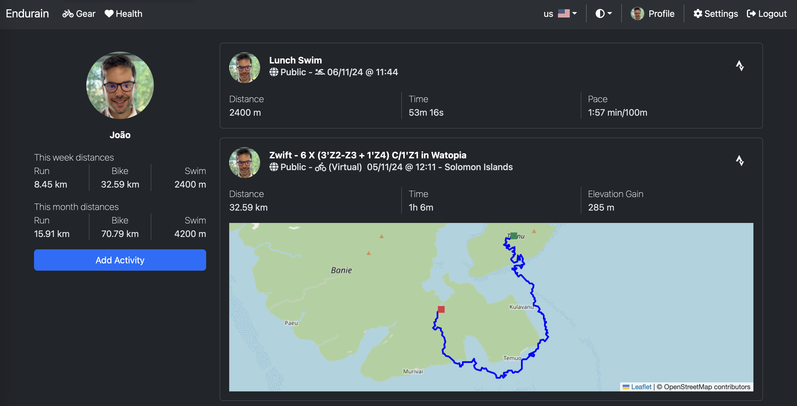

<!-- generated -->

# Endurain

1-Click installation template for Endurain on Easypanel

## Description

Endurain is a cutting-edge endurance tracking and training platform designed for athletes and fitness enthusiasts. It offers a user-friendly interface to track workouts, set goals, and analyze performance metrics. With Endurain, you can manage your training routines using detailed analytics, route planning, and personalized coaching features. It supports integrations with fitness devices and third-party tools, making it a versatile solution for athletes at any level. Its emphasis on data-driven insights and seamless user experience ensures athletes stay motivated and achieve their fitness goals. Endurain is distributed under an open-source license, allowing for customization to meet unique training needs.

## Benefits

- Advanced Training Analytics: Endurain provides in-depth performance metrics and analytics to help athletes optimize their training and achieve peak performance.
- Versatile and Adaptable: Endurain integrates with a wide range of fitness devices and third-party tools, ensuring compatibility with various training workflows.
- Open Source and Customizable: Endurain is open-source, allowing athletes and developers to tailor the platform to specific fitness and training needs.

## Features

- Workout Tracking: Endurain enables users to log and track their workouts, ensuring progress and consistency in their fitness journey.
- Route Planning: Plan and optimize training routes with Endurain’s intuitive route mapping feature, tailored for outdoor enthusiasts.
- Goal Setting and Progress Monitoring: Set training goals and monitor progress with personalized insights and automated reminders to stay on track.

## Links

- [Github](https://github.com/joaovitoriasilva/endurain)
- [Template Source](https://github.com/easypanel-io/templates/tree/main/templates/endurain)

## Options

Name | Description | Required | Default Value
-|-|-|-
App Service Name | - | yes | endurain
App Service Image | - | yes | ghcr.io/joaovitoriasilva/endurain:v0.7.2

## Screenshots

## Change Log

- 2025-01-14 – First Release

## Contributors

- [Ahson Shaikh](https://github.com/Ahson-Shaikh)
