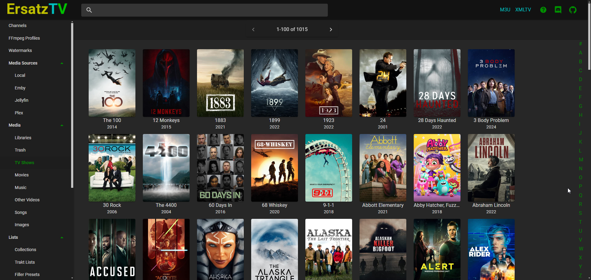

<!-- generated -->

# ErsatzTV

1-Click installation template for ErsatzTV on Easypanel

## Description

ErsatzTV is a modern, web-based IPTV server that creates custom TV channels from your local media library. It streams your movies, TV shows, and other content as continuous TV channels that can be watched on any IPTV-compatible device or application. ErsatzTV provides a sophisticated scheduling system, allowing you to create program guides, manage commercial breaks, and simulate a real TV experience with your personal media collection. Perfect for home entertainment setups, media centers, and creating personalized TV channels from your existing content library.

## Instructions

The application uses /transcode as a temporary directory for processing media files, which is mounted as a volume for optimal performance.

## Benefits

- Custom TV Channels: Transform your personal media library into continuous TV channels with professional scheduling and program guides.
- IPTV Compatibility: Generates standard M3U playlists compatible with any IPTV player or device for seamless viewing experience.
- Advanced Scheduling: Sophisticated scheduling system with program guides, commercial breaks, and realistic TV channel simulation.
- Web-Based Management: Modern web interface for easy channel configuration, media management, and real-time monitoring of your TV streams.

## Features

- Media Library Integration: Automatically scans and organizes your local media files into customizable TV channels with intelligent scheduling.
- Program Guide Generation: Creates detailed EPG (Electronic Program Guide) data for your channels with accurate scheduling and program information.
- Commercial Management: Insert commercials, bumpers, and station identification between programs to create authentic TV channel experience.
- Multi-Channel Support: Run multiple TV channels simultaneously, each with its own schedule, content, and configuration settings.

## Links

- [Website](https://ersatztv.org)
- [GitHub](https://github.com/ersatztv/ersatztv)
- [Documentation](https://ersatztv.github.io/ersatztv/)
- [Template Source](https://github.com/easypanel-io/templates/tree/main/templates/ersatztv)

## Options

Name | Description | Required | Default Value
-|-|-|-
App Service Name | - | yes | ersatztv
App Service Image | - | yes | ghcr.io/ersatztv/ersatztv:v26.3.0
Timezone | Timezone for scheduling and program guides | no | Etc/UTC

## Screenshots

## Change Log

- 2025-10-14 – Initial Template Release
- 2026-04-29 – Version bumped to v26.3.0

## Contributors

- [Ahson Shaikh](https://github.com/Ahson-Shaikh)
